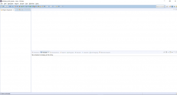

In this blog post, I will demonstrate how you can create a simple HelloWorld class in Eclipse.

**Step1 - Open Eclipse**

**Step 2 - Click on File --> New --> Java Project**

**Step 3 - Enter project Name and Click Next**

**Step 4: Click Finish**

**Your Java project is now ready! You can start creating Java files within the src folder!**

