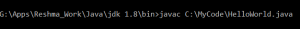
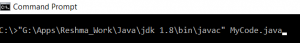
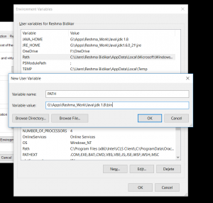
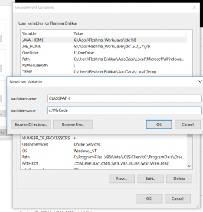

In this blog post, I will be explaining Java PATH and CLASSPATH. Both PATH and CLASSPATH are environment variables that need to be set in order for Java programs to run. But there is a slight difference between the two.  Let's find out.

## What is Path?

The PATH environment variable is used to specify where the JDK binaries like "java" or "javac" are present. You will generally require these binaries to compile or run your program. The "javac" or "java" are exe files provided by Java to compile or run your code. These are present in the JDK\_HOME\\bin folder. So if you want to compile or run your program, you need to do one of the following:

1) Navigate to the JDK\_HOME\\bin and type the javac or java command along with the full path of your Java file:

2) Stay in the directory where your Java files exist but specify the full path of the JDK\_HOME\\bin folder with the java ir javac command.

 

Both these methods are cumbersome and so the easier alternative is to set the PATH variable. In the PATH variable, you need to specify the Path of the JDK\_HOME\\bin folder.  So, now the operating system knows where to look for the binaries when you type in the java\\javac command on the command prompt.

In windows 10, you can set the path by following these steps:

Right-click on My Computer\\This PC icon on desktop --> Click Properties --> Advanced System Setting --> Environment Variables

If there is no PATH set, click on new and type the following (I have specified the path of my JDK\\bin folder, you need to specify the appropriate path on your computer):

If there is already a PATH variable defined, just append your path to the existing path.

## **What is Classpath?**

CLASSPATH is an environment variable that is used to locate and load the .class file. So after compiling your java code, a .class file is created.

When you try to run the program, you need to do one of the following:

1) Navigate to the directory where the .class file is present and then type the java command:

2) Specify the full path of the .class file along with the Java command

Both these methods are cumbersome and so the earlier alternative is to set the CLASSPATH variable. So the CLASSPATH variable specifies the location of your .class files. Once set, the system knows the path to look for your class files when you try to run the code.

In windows, you can set the path by following these steps

 

Right click on My Computer\\This PC icon on desktop --> Click Properties --> Advanced System Setting --> Environment Variables

If there is no PATH set, click on new and type the following (I have specified the path the folder where my .class files are present, you need to specify the appropriate path on your computer):

 

## Conclusion

So, in this article, we understood Java path and classpath.
