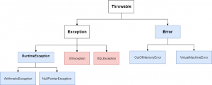

In this blog post, I will be explaining the difference between checked and unchecked exceptions.

#### Checked exceptions

**Checked exceptions** are those scenarios which can be **pre-determined** but **not prevented**. So, during the application design, the developer can **anticipate** that the program might run into such an exception. However, the programmer can do nothing to prevent these exceptions. So the only course of action is to **handle** the **exception**. So in case the code is capable of throwing some checked exception, the compiler will cause a **compilation error** if the exception is not handled.

#### Unchecked exceptions

**Unchecked exceptions** are caused either due to **programming mistakes** or due to **hardware failure** or some other system error. Because the programmer **cannot anticipate** them, the compiler does not require you to track unchecked exceptions.

Consider the following diagram:

 

The boxes in **blue** represent **unchecked exceptions**, while the ones in **pink** represent the **checked exceptions**.

The **[Throwable](https://docs.oracle.com/javase/8/docs/api/java/lang/Throwable.html)** class is at the top of the exception hierarchy. It has two subclasses, **[Exception](https://docs.oracle.com/javase/8/docs/api/java/lang/Exception.html) and [Error](https://docs.oracle.com/javase/8/docs/api/java/lang/Error.html)**. **[Exception](https://docs.oracle.com/javase/8/docs/api/java/lang/Exception.html)** has an important sub-class, the **[RuntimeException](https://docs.oracle.com/javase/8/docs/api/java/lang/RuntimeException.html)**. These represent exceptions that occur due to some **programming mistakes** like **referencing a null value**, **dividing by 0**, etc. These are **unchecked** exceptions.

There are also other sub-classes on the **[Exception](https://docs.oracle.com/javase/8/docs/api/java/lang/Exception.html)** class. These represent **programming errors** that can be anticipated but not prevented and so these are **checked exceptions**. The diagram above shows **[IOException](https://docs.oracle.com/javase/8/docs/api/java/io/IOException.html)** and **[SQLException](https://docs.oracle.com/javase/8/docs/api/java/sql/SQLException.html).** In addition, there are several other **checked exceptions**. You can check them out [here](https://docs.oracle.com/javase/8/docs/api/java/lang/Exception.html).

Finally, The **[Error](https://docs.oracle.com/javase/8/docs/api/java/lang/Error.html)** class is a sub-class of **[Throwable](https://docs.oracle.com/javase/8/docs/api/java/lang/Throwable.html)**. It represents errors that represent hardware or system failure. Since such errors cannot be anticipated, these are also **unchecked exceptions**.
