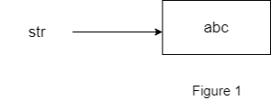
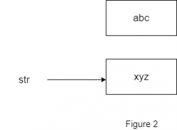

You might have heard a lot about Java Strings being **immutable**. You might have also faced interview questions where you are asked to explain this. In this blog post, I will be shedding some light on this with examples.

So yes, **Java Strings** are indeed **immutable**. So what does **immutable** mean? It means that String objects are constants, their values cannot be changed after they are created.

Now consider the following code:

````
String str= "abc";
str= "xyz";
````

**Is the above code valid?**

Yes, the above lines are perfectly valid. Now this might appear confusing to a new programmer because we are changing the value of "_str"_ from "_abc_" to "_xyz_". But that is not so.

The object "_abc_" remains as it is and a new object "_xyz_" is created. The object reference "_str_" no longer points to the memory address of "_abc_", but it points to the address of "_xyz_". And what about "_abc_"? It continues to exist as it is until it is garbage collected.

The following diagram depicts this scenario. In **Figure 1**, the variable "_str_" points to the String "_abc_" whereas in **Figure 2** the variable "_str_" points to the String "_xyz_" but the String "_abc_" still exists in memory.


 
