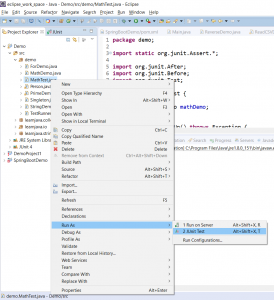
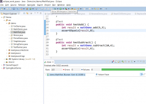
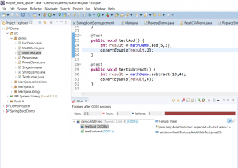

In this blog post, I will be explaining how you can run JUnit unit tests to test your code.

#### What is JUnit?

[JUnit](https://junit.org) is a unit testing framework for Java. It is used by developers to test individual code and ensure that code works the way it was intended to. The current version of JUnit is [JUnit 5](https://junit.org/junit5/).

 

#### Why JUnit?

Consider the following code snippet:

\[java\]

package demo;

public class MathDemo {

public int add(int a,int b){ return a+b; }

public int subtract(int a,int b){ return a-b; } }

\[/java\]

 

So this class has two methods, called **add** and **subtract**. The add method **adds** 2 numbers and returns the sum while the subtract methods returns the **difference** of the 2 input numbers.  Now traditionally, if you want to test if this code works, you would write a main method like this:

\[java\]

public static void main(String args\[\]){ MathDemo mathDemo = new MathDemo(); int sum = mathDemo.add(5,4); int diff = mathDemo.subtract(9, 3); System.out.println("Sum is "+sum); System.out.println("Difference is "+diff);

}

\[/java\]

The problem with using an approach like this is, its dependent on **human intervention**. So when the Sysout statement is printed, you need to manually verify whether the printed output is correct. Now, for a simple example like this, it might not matter much, but when the code gets complex, this approach will be time consuming and error prone. JUnit on the other hand automates the testing process for you, making the code less error prone.

#### How can you setup JUnit?

There are a couple of ways to setup JUnit. You can [download](https://search.maven.org/remotecontent?filepath=junit/junit/4.13-beta-1/junit-4.13-beta-1.jar) the jar file from the official  and add it to your classpath.

You can also set it up via Maven, you will need to add the following JUnit dependency to your pom file:

\[xml\]

<dependency> <groupId>junit</groupId> <artifactId>junit</artifactId> <version>4.12</version> <scope>test</scope> </dependency>

\[/xml\]

#### How to use JUnit?

Consider the following JUnit code:

 

\[java\]

package demo;

import static org.junit.Assert.\*;

import org.junit.After; import org.junit.Before; import org.junit.Test;

public class MathTest {

private MathDemo mathDemo;

@Before public void setUp() throws Exception { mathDemo = new MathDemo(); }

@After public void tearDown() throws Exception { }

@Test public void testAdd() { int result = mathDemo.add(5,3); assertEquals(result,8); }

@Test public void testSubtract() { int result = mathDemo.subtract(10,4); assertEquals(result,6); }

}

\[/java\]

 

Using the above code, you can automatically test your code, without any human intervention. The above class is known as a **Testcase**. You need to have a separate method in the Testcase class for each method that you want to test. Each method that needs to be executed as a test needs to have the **@Test** annotation. This tells JUnit that this is a test method. Here, we have the following methods with the **@Test** annotation:

 

**testAdd** - This method tests the add method in the **MathDemo** class. It invokes the add method using two numbers. It then uses the **assertEquals** method to check if the actual result is the same as the expected result. If the result is correct, the test case is said to have passed, otherwise the test case fails. So now, human intervention is no longer needed, if the code is functioning properly, the test case passes, otherwise the test case fails.

**testSubtract** - This method tests the subtract method in the **MathDemo** class. As in the case of the **testAdd** method, it invokes the subtract method using two numbers and uses the **assertEquals** method to check if the actual result is the same as the expected result.

In addition to these two methods, this class also has the following methods:

 

**setUp** - This method is executes before invoking any test. Here, you can write any **setup** code. In our case, we are creating the **MathDemo** class.

 

**tearDown**\- This method is invoked after all tests are completed. Here you can write any **cleanup** code. This method does not have implementation in our case.

 

#### How to run the JUnit tests?

If you are not using an IDE like Eclipse, you need to create a TestRunner code as follows to run the unit tests:

\[java\]

public class TestRunner {

public static void main(String\[\] args) { Result result = JUnitCore.runClasses(MathTest.class);

for (Failure failure : result.getFailures()) { System.out.println(failure.toString()); }

System.out.println(result.wasSuccessful()); } }

\[/java\]

 

This class can be executed like any normal Java class. So if we run the code, we will get the following output:

```
true
```

 

However, if we change the MathTest class as follows:

\[java\]

@Test public void testAdd() { int result = mathDemo.add(5,3); assertEquals(result,3); }

\[/java\]

 

If you run the **TestRunner** class now, the following output will be printed:

```
testAdd(demo.MathTest): expected:<8> but was:<3>
false
```

 

#### How to run JUnit tests in Eclipse?

If you are using an IDE like Eclipse, you do not need the TestRunner class. You can directly right click on the test case class and run the JUnit test as follows:

[](https://learnjava.co.in/wp-content/uploads/2019/01/junit.png)

This will print display a **JUnit console** as follows (In case the **tests** are **successful**):

[](https://learnjava.co.in/wp-content/uploads/2019/01/junit2.png)

 

In case the tests **fail**, it will display a console as follows:

[](https://learnjava.co.in/wp-content/uploads/2019/01/Junit3.png)
