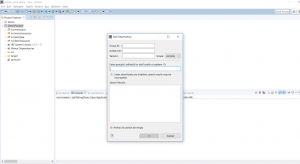
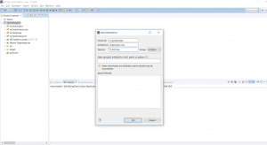
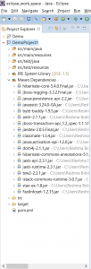

In this blog post, I will be giving step by step directions on how you can add Maven dependencies via Eclipse.

#### What is Maven

Maven as you might probably know is a dependency management tool. It automatically downloads the necessary jar files for you.So you do not need to download the jar files and add them to your classpath explicitly.Maven uses a file named as pom.xml. This file has all the project configuration. The external jar files that are needed for the project need to be added as dependencies in this pom file. So for example, if you need Hibernate JAR files in your project, you will need to add Hibernate dependencies in the pom file. Maven then automatically downloads the jar files and adds them to the classpath. So let's get started.

#### Adding Maven Dependencies Via Eclipse

**Step 1 - Create your Maven project via Eclipse (Refer [this](../../2018/10/how-to-create-a-maven-project-in-eclipse.md) post)**

**Step 2 - Right click on pom.xml. Click on Maven --> Add Depenency**

**Step 3 - Enter group id, artifact id and version for the Dependency that you wish to add.** Suppose, you need to add the dependency for hibernate. You can enter the following:

- org.hibernate
- hibernate-core
- 5.4.0.Final

In order to determine the group id and artifact id for a particular dependency, you can visit [https://mvnrepository.com](https://mvnrepository.com). You can search for the dependency that you wish to add. By specifying the group id, artifact id and version, we are telling Maven the exact name and version of the Jar file that we need

**Step 4 - Click OK. This will automatically download the hibernate related Jar files and add them to the classpath.**

**Step 5(Optional) - You can verify the JAR files under the Maven dependencies:**

**Step 6 - That is all!! So you can now write code that uses Hibernate without any issues!**

**Further Reading**

- [Apache Maven Beginner to Guru](https://click.linksynergy.com/deeplink?id=MnzIZAZNE5Y&mid=39197&murl=https%3A%2F%2Fwww.udemy.com%2Fcourse%2Fapache-maven-beginner-to-guru%2F)
- [Maven Crash Course](https://click.linksynergy.com/deeplink?id=MnzIZAZNE5Y&mid=39197&murl=https%3A%2F%2Fwww.udemy.com%2Fcourse%2Fmavencrashcourse%2F)
- [Java Programming in Eclipse](https://click.linksynergy.com/deeplink?id=MnzIZAZNE5Y&mid=39197&murl=https%3A%2F%2Fwww.udemy.com%2Fcourse%2Feclipse-the-basic-java-programming-course%2F)
