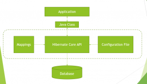

In this blog post, I will be comparing JDBC and Hibernate and explaining the differences between the two.

#### What is JDBC?

JDBC is nothing but an API to access a relational database from a java program. JDBC basically allows you to execute SQL statements from Java code, so basically any SQL statement which you can run on a database directly, you can run it from your Java code via JDBC.

#### Disadvantages of JDBC

In order to query a database table via JDBC, you will need code similar to the following:

````
Class.forName("com.mysql.jdbc.Driver"); //Register JDBC Driver

Connection conn = DriverManager.getConnection(url, username, password); //Open a connection

Statement stmt = conn.createStatement(); //create a statement

ResultSet rs = stmt.executeQuery("Select * from book");// Execute a query

while(rs.next()) { //iterate through the resultset
    String bookName = rs.getString("book\_name");
}

rs.close();

stmt.close();

conn.close(); 
````

Suppose you want to query a table called Book via JDBC. You will need to code similar to this. So those of you who are familiar with JDBC will know that you need to open a [Connection](https://docs.oracle.com/javase/8/docs/api/java/sql/Connection.html) to the database. Then you need to create a [Statement](https://docs.oracle.com/javase/8/docs/api/java/sql/Statement.html). Then you need to execute a query and then iterate through the [Resultset](https://docs.oracle.com/javase/8/docs/api/java/sql/ResultSet.html) in order to obtain the results. Finally, you need to close the [Resultset](https://docs.oracle.com/javase/8/docs/api/java/sql/ResultSet.html),[Statement](https://docs.oracle.com/javase/8/docs/api/java/sql/Statement.html) and [Connection](https://docs.oracle.com/javase/8/docs/api/java/sql/Connection.html) .

This code has several downsides. For one, the code is quite a bit and does not look very clean. We are directly using SQL statements in the code. Here we are using a simple select statement, but if you use SQL syntax that is specific to a database, then your code will no longer work if you switch to a different database. Also, Since JDBC uses SQL directly in the code, it’s very hard to map database tables to objects in the code. So If you have a Book class, you will need to set each field in the class with the corresponding field from the database inside the while loop. Also, the same boilerplate code needs to be repeated. So each time you want to query a table, you will need to create a Resultset,Statement and remember to close them once the database operations are completed.   Also, this code is brittle, if you make changes to your database i.e. if you Add or remove some columns you will need to modify your code to match the database changes. Finally, this code is not object oriented. To overcome all these issues, Hibernate came into existence.

#### What is Hibernate?

Hibernate is an **ORM** tool. **ORM** is nothing but a programming technique that allows you to map Java objects to database tables and vice versa.

#### How does Hibernate work?

Consider the following diagram:

[](images/hibernate.png) 

The Java application that wants to query the database needs to create a simple Java class corresponding to the database table i.e. it should have fields corresponding to each column in the DB table. Hibernate uses a configuration file and mapping information and converts the information in the Java class into SQL statements. So end users do not need to write any SQL code, they just need to supply the Java class corresponding to the database table, the mapping file and the configuration file. Hibernate does all the magic under the hood to perform the database operations. So the above JDBC code can be re-written using Hibernate as follows:

````
SessionFactory sessionFactory = HibernateUtil.getSessionFactory(); 
Session session = sessionFactory.openSession(); 
Transaction tx = session.beginTransaction(); 
Book book = session.load(Book.class, 2); 
System.out.println("Book record retrieved successfully, book name is "+book.getBookName()); 
tx.commit(); 
session.close(); 
HibernateUtil.closeSessionFactory();
````

So if you look at this code, it's much cleaner than the Hibernate code. There are no SQL statements since your objects are mapped to tables. There is a session.load method that loads the Book object corresponding to the id specified. So the code is object oriented.

#### Summary

Both Hibernate and JDBC allow you to access relational tables from Java code. Hibernate provides a clean and  object oriented way to access the database. The only downside to Hibernate is that performance wise, it is a little slower compared to JDBC since it sits on top of JDBC. The following table provides a detailed comparison between JDBC and Hibernate


| JDBC |Hibernate  |
|--|--|
|Uses SQL statements in the code  |Does not use SQL statements in code  |
|If SQL used is database specific, code will break when a different database is used  | Since SQL is not used, you can easily migrate to a different database |
|Hard to map database tables to objects  | Easily maps database tables to objects |
| Boilerplate code for connection,statement and resultset needs to be repeated. |Boilerplate code is eliminated  |
| If database table is modified i.e. columns are added or deleted, code needs to be modified to match the table | Code does not require much modifications even if database tables are modified |
| Code is not object oriented |Code is object oriented  |
|Is better performance wise since it directly queries tables|Its a bit slower compared to JDBC since it sits on top of JDBC|
