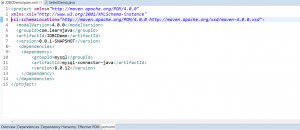
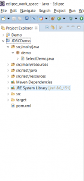

In this blog post, I will be explaining how you can query a database table via JDBC. JDBC as you might probably know stands for Java Database Connectivity .It is an API which can be used to access a relational database from Java code. Using JDBC, you can execute SQL queries directly from Java code. JDBC has been around for a very long time now.  Although nowadays ORM frameworks like Hibernate, SpringDAO, JPA etc are used to access a database, there is still a lot of legacy code around that uses JDBC. So in this blog post, I will be covering how you use JDBC to query a table.

 

#### Database Setup

##### Step 1  - Install MySQL.

This step is optional, you need to follow this step only if you want to use a MySQL database. You can download it from [here](https://dev.mysql.com/downloads/installer/). You can download the version that is appropriate for your operating system. This will download the MySQL Installer. Once the download is complete, you can follow the onscreen instructions to proceed with the installation.I recommend going with the developer default that installs MySQL, MySQLWorkbench and other utilities required for development.

##### Step 2 - Create Sample database with data

We will first need to create a database table. We will also need to insert some test data into the table. The code that we are going to write will then query this via JDBC. You can execute the following SQL code to create the sample database and insert some data into it.

\[sql\]

drop database if exists PersonDB; create database PersonDB; use persondb;

create table person ( id int auto\_increment, first\_name varchar(20), last\_name varchar(20), age int , primary key (id) );

insert into person (first\_name,last\_name,age) values ('mickey','mouse',10);

\[/sql\]

If you are using MySQL, then open MySQLWorkBench, Open a new query tab and just copy and paste the SQL code given above.

#### Code Setup

##### Step 3 - Create a new Maven project in Eclipse

In this example, I will be using Eclipse and Maven.  So you will need to create a new Maven project in Eclipse. You can refer [this](https://learnjava.co.in/how-to-create-a-maven-project-in-eclipse/) post in order to understand how to create a Maven project in Eclipse.

The advantage of using a dependency management tool like Maven is that it automatically downloads the necessary jar files for you, you just need to add the appropriate dependency in the Maven pom file.

##### Step 4 - Add Database Driver dependency

As you might know, JDBC requires a database specific driver to communicate with the database. A driver is nothing but a Jar file. Each database, be it MySQL, Oracle or PostgreSQL, has its own specific drivers which you need to use if you want to connect to that database via JDBC. Since we are using Maven, you need to add the dependency for the driver in your Maven pom file. If you are using MySQL, you can add the following to your pom file:

JDBC For this double click on the pom.xml and add the following:

\[xml\] <dependency> <groupId>mysql</groupId> <artifactId>mysql-connector-java</artifactId> <version>8.0.12</version> </dependency> \[/xml\]

Your final pom file should look like this:



So this will automatically download the MySQL driver and add it to the classpath. If you are using some other database, then you need to add the appropriate dependency for that database.

##### Step 5 - Create Java class.

Create a new package called demo and create a new Class in this package called SelectDemo.



#### Write and Run Code

##### Step 7 - Write Java Code.

Add the following code to the SelectDemo class written earlier:

\[java\]

package demo; import java.sql.Connection; import java.sql.DriverManager; import java.sql.ResultSet; import java.sql.SQLException; import java.sql.Statement;

public class SelectDemo {

public static void main(String\[\] args) { Connection conn = null; Statement stmt = null; try { // Step 1 - Register JDBC driver Class.forName("com.mysql.jdbc.Driver");

// Step 2 - Open a connection conn = DriverManager.getConnection("URL", "USERNAME", "PASSWORD");

//Step 3 - Create statement stmt = conn.createStatement(); //Step 4 - Execute query String query = "select \* from person"; ResultSet rs = stmt.executeQuery(query);

// Step 5 - Iterate through the resultset and print values while (rs.next()) { // Retrieve by column name int id = rs.getInt("id"); String firstName = rs.getString("first\_name"); String lastName = rs.getString("last\_name"); int age = rs.getInt("age");

// Print values System.out.print("ID: " + id); System.out.print(", first\_name: " + firstName); System.out.print(", last\_name: " + lastName); System.out.println(", age: " + age); } //Step 6 - Close all resources rs.close(); stmt.close(); conn.close(); } catch (SQLException e) { System.out.println("SQL Exception occured:"); e.printStackTrace(); } catch (Exception e) { System.out.println("Exception occured:"); e.printStackTrace(); } }// end main

}

\[/java\]

The above code can be broken down into the following steps:

- Step 1 - Register the JDBC Driver - This step initializes the JDBC driver
- Step 2  - Open a connection - This opens a Connection to the database. Here, you need to specify the database URL, username and password.  This returns a [Connection](https://docs.oracle.com/javase/7/docs/api/java/sql/Connection.html) object.
- Step 3 - Create a statement. There is a [connection.createStatement](https://docs.oracle.com/javase/7/docs/api/java/sql/Connection.html#createStatement\(\)) method that returns a [Statement](https://docs.oracle.com/javase/7/docs/api/java/sql/Statement.html) object. A [Statement](https://docs.oracle.com/javase/7/docs/api/java/sql/Statement.html) object is used for executing an SQL query
- Step 4 - Execute the query. There is a [statement.executeQuery](https://docs.oracle.com/javase/7/docs/api/java/sql/Statement.html#executeQuery\(java.lang.String\)) method. This executes the SQL query. It returns a [ResultSet](https://docs.oracle.com/javase/7/docs/api/java/sql/ResultSet.html) object.
- Step 5 - Iterate through the results. A while loop is used to iterate through the [ResultSet](https://docs.oracle.com/javase/7/docs/api/java/sql/ResultSet.html) object. There a several getter methods available on the [ResultSet](https://docs.oracle.com/javase/7/docs/api/java/sql/ResultSet.html) object. Depending on the data type being retrieved, the appropriate getter method is used. So since the id is an integer value, the [rs.getInt](https://docs.oracle.com/javase/7/docs/api/java/sql/ResultSet.html#getInt\(java.lang.String\)) method is used.
- Step 5 - Close resources - All the resoures, that is the [ResultSet](https://docs.oracle.com/javase/7/docs/api/java/sql/ResultSet.html), [Statement](https://docs.oracle.com/javase/7/docs/api/java/sql/Statement.html) and [Connection](https://docs.oracle.com/javase/7/docs/api/java/sql/Connection.html) objects are closed.

 

##### Step 8 - Run the code.

This will print the following output:

```
ID: 1, first_name: mickey, last_name: mouse, age: 10
```
