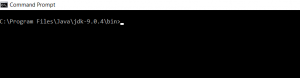
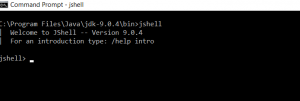
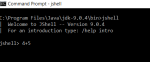
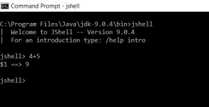
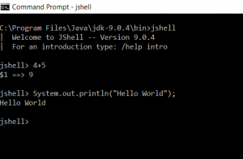
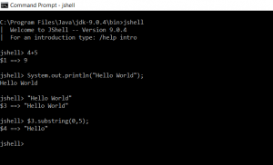
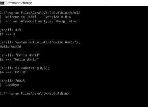

One of the new features added by Java 9 is the JShell. In this blog post, I will be explaining how JShell works.

# What is JShell ?

JShell provides REPL capabilities to Java. REPL stands for Read Evaluate Print Loop. Many languages like Python also provide REPL capabilities.

REPL allows you to write Java code and test it without the need to compile it.

# How to launch JShell

Step 1 - Make sure you have JDK 9 installed

Step 2 -Open a Command prompt and navigate to the JDK\\bin folder

Step 3 - Type JShell

# How to Use JShell

Type the code that you want to test. I have typed 4+5. Press Enter

Step 5 - View the results

Example 2 - Using a Sysout statement

Example 3 - Assigning a value to a variable and using it

# How to exit JShell

Type /exit

