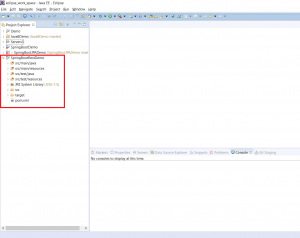
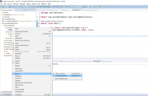
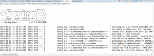
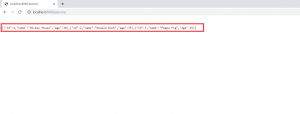
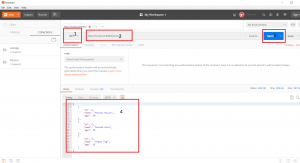
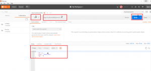
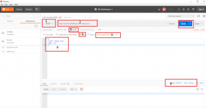

In this blog post, I will be explaining how you can create a [Spring Boot REST](https://click.linksynergy.com/deeplink?id=MnzIZAZNE5Y&mid=39197&murl=https%3A%2F%2Fwww.udemy.com%2Fcourse%2Fspring-boot-tutorial-for-beginners%2F) service.  If you would like to see how to create a basic HelloWorld Spring Boot application refer to [this](https://learnjava.co.in/how-to-create-a-hello-world-spring-boot-web-application-in-eclipse-using-maven/) blog post.

## Project Creation and Setup

**Step 1 - Create a new [Maven](https://click.linksynergy.com/deeplink?id=MnzIZAZNE5Y&mid=39197&murl=https%3A%2F%2Fwww.udemy.com%2Fcourse%2Fmavencrashcourse%2F) Project** (Refer to [this](https://learnjava.co.in/how-to-create-a-maven-project-in-eclipse/) blog post)

[](images/1.png)


**Step 2 - Add the following Spring Boot dependencies to the POM file and save.**

```
	<parent>
  <groupId>org.springframework.boot</groupId>
  <artifactId>spring-boot-starter-parent</artifactId>
  <version>2.1.2.RELEASE</version>
</parent>
<dependencies>
<dependency>
  <groupId>org.springframework.boot</groupId>
  <artifactId>spring-boot-starter-web</artifactId>
</dependency>
</dependencies>
```

## Writing Code

**Step 3 - Create Person class as follows**

```
package com.learnjava.model;

public class Person {
  
  private int id;
  private String name;
  private int age;
  
  public int getId() {
    return id;
  }
  public void setId(int id) {
    this.id = id;
  }
  
  public Person(){
    
  }
  
  public Person(int id,String name, int age) {
    super();
    this.id=id;
    this.name = name;
    this.age = age;
  }
//getter and setter methods
}
```

### Person class

This is the model class. It represents a Person. It has 3 fields, id, name and age.

**Step 4 - Create a PersonController class as follows:**

```
package com.learnjava.controller;

import java.util.ArrayList;
import java.util.List;

import org.springframework.beans.factory.annotation.Autowired;
import org.springframework.http.ResponseEntity;
import org.springframework.web.bind.annotation.GetMapping;
import org.springframework.web.bind.annotation.PathVariable;
import org.springframework.web.bind.annotation.PostMapping;
import org.springframework.web.bind.annotation.RequestBody;
import org.springframework.web.bind.annotation.RequestMapping;
import org.springframework.web.bind.annotation.RestController;

import com.learnjava.model.Person;

@RestController
public class PersonController {

  
  @GetMapping("/person")
  public List<Person> getAllPersons(){
    //Returns hardcoded data, a real world application would return from the database
    List<Person> personList = new ArrayList<Person>();
    personList.add(new Person(1,"Mickey Mouse", 30));
    personList.add(new Person(2,"Donald Duck", 35));
    personList.add(new Person(3,"Peppa Pig", 15));
    return personList;
  } 
  
  @GetMapping("/person/{personId}")
  public Person getPersonWithId(@PathVariable Integer personId){
    //Returns hardcoded data, a real world application would return from the database
    return new Person(3,"Peppa Pig", 15);
  } 
  
  
  @PostMapping("/person/newperson")
  public void addPerson(@RequestBody Person person){
    //Just has a Sysout stmt, a real world application would save this record to the database
    System.out.println("Saving person information");
    
  }

}

```

### PersonController class

This is a Controller class. It specifies the method which will handle the requests from the client. It has the following methods.

#### Methods

**getAllPersons**

This returns all Person objects. A real-world application would query a database and return the Person objects. This code simply returns a List of Person objects.

**getPersonWithId** This returns a Person object corresponding to the id specified. A real-world application would query a database and return a Person objects corresponding to the id specified. This code simply returns a hard-coded Person object

**addPerson**

This saves the Person object passed in. A real-world application would save the Person object into the database. This code simply executes a Sysout statement.

#### Annotations

**@RestController annotation**

This is specified at the class level. This designates the class as a REST controller, i.e. a controller that handles REST requests. It internally includes the @ResponseBody annotation which converts the Java value returned by the method into JSON. This annotation was added since Spring 4.0. It is a convenience annotation that combines the @Controller and @ResponseBody annotations.

**@GetMapping Annotation**

This annotation specifies the URL that this method maps to and also specifies that it is an HTTP GET Request. It is a composite annotation that acts as a shortcut for @RequestMapping(method = RequestMethod.GET). This is specified for the getAllPersons and getPersonWithId methods.

**@PostMapping Annotation**

This annotation specifies the URL that this method maps to and also specifies that it is an HTTP POST Request. It is a composite annotation that acts as a shortcut for @RequestMapping(method = RequestMethod.POST). This is specified on the addPerson method

**@RequestBody Annotation**

This annotation needs to be specified when an object is passed to a method. It automatically deserializes the JSON object to a Java object.

**Step 5 - Finally, create a Main.java as follows:**

```
package com.learnjava;

import org.springframework.boot.SpringApplication;
import org.springframework.boot.autoconfigure.EnableAutoConfiguration;
import org.springframework.boot.autoconfigure.SpringBootApplication;
import org.springframework.web.bind.annotation.RequestMapping;
import org.springframework.web.bind.annotation.RestController;

@SpringBootApplication
public class Main {

    public static void main(String[] args) {
          SpringApplication.run(Main.class, args);
      }

}
```

### Main

This is the starting point of the application.

## Running the Application

**Step 6 - Run Main.java as a Java application as follows:**

[](images/3.png)

This will display the following on the console:

[](images/4.png)

## Testing Via Browser

### Get All Persons

Open a browser window and type the following URL:

http://localhost:8080/person/

This will display the following:

[](images/5.png)

### Get Person By Id

Open a browser window and type the following URL:

http://localhost:8080/person/3

This will display the following:

[](images/6.png)

### Add Person

This cannot be tested in a Browser as it is a POST request

## Testing Via Postman

Postman is a client-side application that allows you to test REST services easily. You can download Postman from the Postman like [here](https://www.getpostman.com/downloads/). Once download is complete, you can click the desktop shortcut to launch Postman.

### Get All Persons

1. Select Request Type as "GET"
2. Enter URL as "http://localhost:8080/person/"
3. Click on "Send".
4. This will show the "JSON" response sent by the server in the body below as follows:

[](images/7.png)

### Get Person By Id

1. Select Request Type as "GET"
2. Enter URL as "http://localhost:8080/person/3",
3. Click on "Send".
4. This will show the "JSON" response sent by the server in the body below as follows:

[](images/8.png)

### Add Person

1. Select Request Type as "POST"
2. Enter URL as "http://localhost:8080/person/newPerson".
3. Click Body
4. Select "Raw"
5. Type as "JSON(Application/JSON"),
6. Enter the data to be saved in JSON format as shown below.
7. Click on "Send".
8. This will show the HTTP Status 200 sent by the server.

[](images/9.png)

You can download the source code for this project via the Github repository [here](https://github.com/learnjavawithreshma/SpringBootRestDemo).
