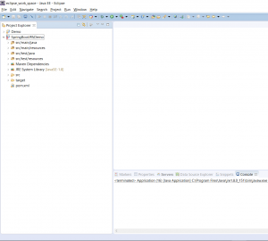
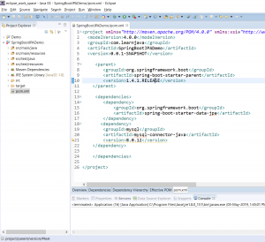
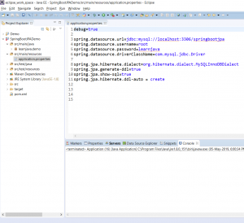

In this blog post, I will be demonstrating how you can insert records and query a database table via [Spring Boot](https://click.linksynergy.com/deeplink?id=MnzIZAZNE5Y&mid=39197&murl=https%3A%2F%2Fwww.udemy.com%2Fcourse%2Fspring-5-with-spring-boot-2%2F) and [JPA](https://click.linksynergy.com/deeplink?id=MnzIZAZNE5Y&mid=39197&murl=https%3A%2F%2Fwww.udemy.com%2Fcourse%2Fspring-data-jpa-using-hibernate%2F) using Eclipse and Maven

## Step 1 - Create a New Maven Project

Create a new Maven project. (Refer to [this](https://learnjava.co.in/how-to-create-a-maven-project-in-eclipse/) blog post). This will create a project in Eclipse as follows:

[](images/SpringBootJPA1.png)

## Step 2 - Add Spring Boot JPA dependencies to the pom file

Add the following text to the pom.xml file:

```
<project xmlns="http://maven.apache.org/POM/4.0.0" xmlns:xsi="http://www.w3.org/2001/XMLSchema-instance" xsi:schemaLocation="http://maven.apache.org/POM/4.0.0 http://maven.apache.org/xsd/maven-4.0.0.xsd">
  <modelVersion>4.0.0</modelVersion>
  <groupId>com.learnjava</groupId>
  <artifactId>SpringBootJPADemo</artifactId>
  <version>0.0.1-SNAPSHOT</version>
  
     <parent>
        <groupId>org.springframework.boot</groupId>
        <artifactId>spring-boot-starter-parent</artifactId>
        <version>1.4.1.RELEASE</version>
    </parent>
    
     <dependencies>
        <dependency>
            <groupId>org.springframework.boot</groupId>
            <artifactId>spring-boot-starter-data-jpa</artifactId>
        </dependency>
       <dependency>
  		<groupId>mysql</groupId>
  		<artifactId>mysql-connector-java</artifactId>
  		<version>8.0.12</version>
  	</dependency>
       
    </dependencies>
    
</project>
```

So the pom file will look as follows:

[](images/SpringBootJPA2.png)

## Step 3 - Create config file

Spring Boot requires us to specify the configuration information in a properties file. This should be present within the src/main/resources folder. So we will need to create a file called application.properties as follows:

```
debug=true

spring.datasource.url=jdbc:mysql://localhost:3306/springbootjpa
spring.datasource.username=<username>
spring.datasource.password=<password>
spring.datasource.driverClassName=com.mysql.jdbc.Driver

spring.jpa.hibernate.dialect=org.hibernate.dialect.MySQLInnoDBDialect
spring.jpa.generate-ddl=true
spring.jpa.show-sql=true
spring.jpa.hibernate.ddl-auto = create
```
So the properties file specifies values for database properties like username, password, database driver, dialect, etc.

It will look as follows in Eclipse:

[](https://learnjava.co.in/wp-content/uploads/2019/05/SpringBootJPA3.png)

## Step 4 - Create Entity class

Create a class which corresponds to the database table. Here, we will be creating a class called Person with 2 fields, name and age. It also needs to have an id field. So consider the following code:

```
package learnjava.demo;

import javax.persistence.Entity;
import javax.persistence.GeneratedValue;
import javax.persistence.GenerationType;
import javax.persistence.Id;

@Entity
public class Person {
  
  @Id
  @GeneratedValue(strategy = GenerationType.AUTO)
  private int id;
  private String name;
  private int age;
  
  public Person(){
  }
  
  public Person(String name, int age) {
    super();
    this.name = name;
    this.age = age;
  }

        //getters and setters
  public String toString(){
    return this.name+":"+this.age;
  }
}
```

## Step 5 - Create Repository class

Spring Data JPA requires a Repository interface per Entity class. This interface should extend the JPARepository interface. The JPARepository interface already has certain methods for performing the CRUD operations, so these methods become available to the code. So in our example, we will need to create a Repository interface as follows:

```
package learnjava.demo;

import org.springframework.data.jpa.repository.JpaRepository;


public interface PersonRepository extends JpaRepository<Person, Long>{

}
```

## Step 6 - Add Code

Next, we will need to write the code that actually inserts data into the Person table and queries the table. Create a class called Application.java with the following code:

```
package learnjava.demo;

import java.util.List;

import org.springframework.beans.factory.annotation.Autowired;
import org.springframework.boot.CommandLineRunner;
import org.springframework.boot.SpringApplication;
import org.springframework.boot.autoconfigure.SpringBootApplication;

@SpringBootApplication
public class Application implements CommandLineRunner {
  
  @Autowired
  PersonRepository personRepo;
  
  public static void main(String args[]){
     SpringApplication.run(Application.class, args);
  }

  public void run(String... arg0) throws Exception {
    System.out.println("Inserting person records:");
    
    Person person1 = new Person("Mickey Mouse",35);
    Person person2 = new Person("Donald Duck",30);
    personRepo.save(person1);
    personRepo.save(person2);
    
    List<Person> personList = personRepo.findAll();
    personList.forEach(person -> System.out.println(person.toString()));
    
    
  }

}
```

This code creates 2 Person records. It invokes the personRepo.save method which in turn invokes the JPARepository.save and saves the record into the Person table. Next, it invokes the personRepo.findAll method which in turn invokes the JPARepository.findAll method. This returns all the records from the database.

## Step 7 - Run code

You can execute the Application.java as a normal Java application. So when you execute the code, it will print the following output on the console:

```
Inserting person records:
2019-05-06 09:27:12.662 DEBUG 14096 --- [ main] org.hibernate.SQL : insert into person (age, name) values (?, ?)
Hibernate: insert into person (age, name) values (?, ?)
2019-05-06 09:27:13.160 DEBUG 14096 --- [ main] org.hibernate.SQL : insert into person (age, name) values (?, ?)
Hibernate: insert into person (age, name) values (?, ?)
2019-05-06 09:27:13.732 INFO 14096 --- [ main] o.h.h.i.QueryTranslatorFactoryInitiator : HHH000397: Using ASTQueryTranslatorFactory
2019-05-06 09:27:14.179 DEBUG 14096 --- [ main] org.hibernate.SQL : select person0_.id as id1_0_, person0_.age as age2_0_, person0_.name as name3_0_ from person person0_
Hibernate: select person0_.id as id1_0_, person0_.age as age2_0_, person0_.name as name3_0_ from person person0_
Mickey Mouse:35
Donald Duck:30
```

You can download the complete source code from the GitHub Repository [here](https://github.com/learnjavawithreshma/SpringBootJPADemo).
