In this blog post, I will be explaining how you can create a Spring MVC web application. In order to learn the Spring framework from scratch, you can enroll in this [Spring Course](https://click.linksynergy.com/deeplink?id=MnzIZAZNE5Y&mid=39197&murl=https%3A%2F%2Fwww.udemy.com%2Fcourse%2Fspring-mvc-tutorial-for-beginners-step-by-step%2F).

# Create a Project and And Maven Support

Step 1 - Follow the steps in [this](https://learnjava.co.in/how-to-create-a-maven-web-project-in-eclipse/) article to create a web project in Eclipse with Maven Support. You should see a project as follows:

[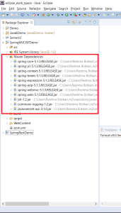](https://learnjava.co.in/wp-content/uploads/2019/06/project-1.png)

\[table id=27 /\]

Step 2 - Add the Maven Dependencies for Spring to the pom file as follows:

```
<dependencies>
  <dependency>
    <groupId>org.springframework</groupId>
    <artifactId>spring-core</artifactId>
    <version>5.1.3.RELEASE</version>
  </dependency>
  <dependency>
    <groupId>org.springframework</groupId>
    <artifactId>spring-context</artifactId>
    <version>5.1.3.RELEASE</version>
  </dependency>
  <dependency>
    <groupId>org.springframework</groupId>
    <artifactId>spring-aop</artifactId>
    <version>5.1.3.RELEASE</version>
  </dependency>
  <dependency>
    <groupId>org.springframework</groupId>
    <artifactId>spring-webmvc</artifactId>
    <version>5.1.3.RELEASE</version>
  </dependency>
  <dependency>
    <groupId>org.springframework</groupId>
    <artifactId>spring-web</artifactId>
    <version>5.1.3.RELEASE</version>
  </dependency>
  <dependency>
    <groupId>javax.servlet</groupId>
    <artifactId>jstl</artifactId>
    <version>1.2</version>
  </dependency>

  <dependency>
    <groupId>commons-logging</groupId>
    <artifactId>commons-logging</artifactId>
    <version>1.2</version>
  </dependency>
  <dependency>
    <groupId>javax.servlet</groupId>
    <artifactId>javax.servlet-api</artifactId>
    <version>3.1.0</version>
    <scope>provided</scope>
  </dependency>

</dependencies>
```

 

# Add Spring Configuration

Step 1 - Right-click on WebContent/WEB-INF -->New --> File

[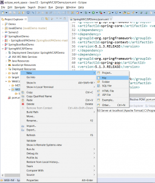](https://learnjava.co.in/wp-content/uploads/2019/05/c1.png)

Step 2 - Type some name. The name should be of the format <name>-servlet.xml. Here, I have used learnjava-servlet.xml

[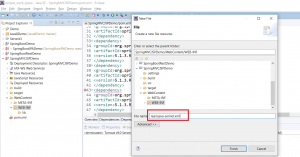](https://learnjava.co.in/wp-content/uploads/2019/05/c2.png)

Step 3 - Click "Finish". This will create a file as follows:

[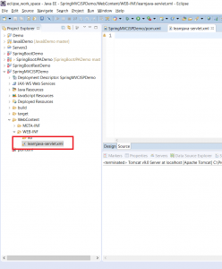](https://learnjava.co.in/wp-content/uploads/2019/05/c3.png)

Step 4 - Enter the following text and save:

```
<?xml version="1.0" encoding="UTF-8"?>
<beans xmlns="http://www.springframework.org/schema/beans"
  xmlns:mvc="http://www.springframework.org/schema/mvc"
  xmlns:context="http://www.springframework.org/schema/context"
  xmlns:xsi="http://www.w3.org/2001/XMLSchema-instance"
  xsi:schemaLocation="
        http://www.springframework.org/schema/beans     
        http://www.springframework.org/schema/beans/spring-beans.xsd
        http://www.springframework.org/schema/mvc 
        http://www.springframework.org/schema/mvc/spring-mvc.xsd
        http://www.springframework.org/schema/context 
        http://www.springframework.org/schema/context/spring-context.xsd">
 
    <context:component-scan
    base-package="com.learnjava.controller" />
        <mvc:annotation-driven />
  <mvc:default-servlet-handler />
 
  <bean id="viewResolver"
    class="org.springframework.web.servlet.view.UrlBasedViewResolver">
    <property name="viewClass"
      value="org.springframework.web.servlet.view.JstlView" />
    <property name="prefix" value="/WEB-INF/jsp/" />
    <property name="suffix" value=".jsp" />
  </bean>
 
</beans>
```

 

# Modify web.xml

Step 1 - Create web.xml (if it does not exist). Refer to [this](https://learnjava.co.in/how-to-create-a-maven-web-project-in-eclipse/) article

Step 2 - Update web.xml to include the Spring MVC Configuration. So add the following:

```
<servlet>
      <servlet-name>learnjava</servlet-name>
      <servlet-class>
          org.springframework.web.servlet.DispatcherServlet
      </servlet-class>
      <load-on-startup>1</load-on-startup>
  </servlet>
  <servlet-mapping>
      <servlet-name>learnjava</servlet-name>
      <url-pattern>/</url-pattern>
  </servlet-mapping>
```

 

# Add Code

Step 1 - Create a new controller class in src folder as follows:

[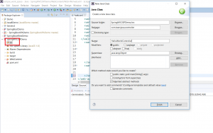](https://learnjava.co.in/wp-content/uploads/2019/06/o1.png)

Step 2 - Add the following code:

```
package com.learnjava.controller;

import org.springframework.stereotype.Controller;
import org.springframework.web.bind.annotation.RequestMapping;
import org.springframework.web.servlet.ModelAndView;

@Controller
public class HelloWorldController {

  @RequestMapping("/hello")
  public ModelAndView helloWorld() {
 
    System.out.println("In HelloWorldController");
    String message = "<br><div style='text-align:center;'>"
        + "<h1>Hello World</h1></div><br><br>";
    return new ModelAndView("hello", "message", message);
  }
}


```

 

Step 3  - Create the WEB-INF/jsp folder as follows:

[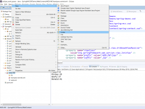](https://learnjava.co.in/wp-content/uploads/2019/06/o2.png)

Step 3 - Enter folder name as "jsp"

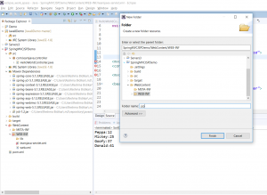

Step 4 - Create hello.jsp

[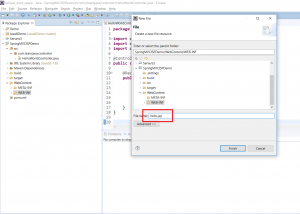](https://learnjava.co.in/wp-content/uploads/2019/06/o5.png)

Step 5 - Add the following code:

```
<html>
<head>LearnJava SpringMVC Example</title>

</head>
<body>${message}
 
  <br>
  <br>
  <div
    style="font-family: verdana; padding: 10px; border-radius: 10px; font-size: 12px; text-align: center;">
 
    Visit <a href="https://learnjava.co.in">LearnJava</a> to learn more Java stuff!!.
  
  </div>
</body>
</html>
```

# Compile

Step 1 - Right Click on Project --> Run As --> Maven Build

[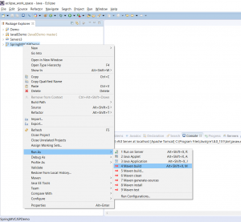](https://learnjava.co.in/wp-content/uploads/2019/06/b1.png)

Step 2 - If prompted, enter the goals as Clean --> Install

[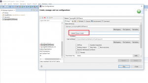](https://learnjava.co.in/wp-content/uploads/2019/06/b2.png)

This will display a build success message as follows:

[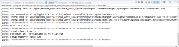](https://learnjava.co.in/wp-content/uploads/2019/06/b3.png)

# Test

You will need to have Tomcat setup in Eclipse. If you do not have Tomcat set up, refer to [this](https://learnjava.co.in/how-to-setup-tomcat-in-eclipse/) blog post.

Step 1 - Right click on "Tomcat Server" at the bottom and click Add/Remove:

[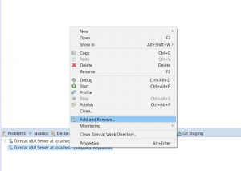](https://learnjava.co.in/wp-content/uploads/2019/06/t1.png)

Step 2 - Select SpringMVCJSPDemo project and click "Add":

 

[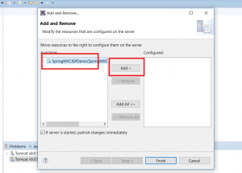](https://learnjava.co.in/wp-content/uploads/2019/06/t2.png)

Step 3 - Click on Finish.

[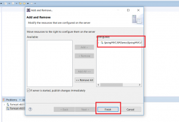](https://learnjava.co.in/wp-content/uploads/2019/06/t3.png)

Step 4 - Right click on "Tomcat" and click on "Start"

[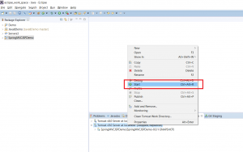](https://learnjava.co.in/wp-content/uploads/2019/06/t4.png)

If the server starts successfully, you should see a message similar to the following in the console:

[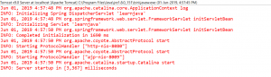](https://learnjava.co.in/wp-content/uploads/2019/06/t5.png)

Step 5 - Open a browser and type http://localhost:8080/SpringMVCJSPDemo/hello. This will display the following:

[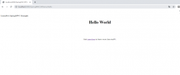](https://learnjava.co.in/wp-content/uploads/2019/06/t6.png)

You can download the complete source code from the Github repository [here](https://github.com/learnjavawithreshma/SpringMVCJSPDemo).

## Further Learning

[Spring MasterClass](https://click.linksynergy.com/deeplink?id=MnzIZAZNE5Y&mid=39197&murl=https%3A%2F%2Fwww.udemy.com%2Fcourse%2Fjava-spring-framework-masterclass%2F) [Spring Tutorial For Beginners](https://click.linksynergy.com/deeplink?id=MnzIZAZNE5Y&mid=39197&murl=https%3A%2F%2Fwww.udemy.com%2Fcourse%2Fspring-tutorial-for-beginners%2F) [Step by Step Spring MVC Tutorial](https://click.linksynergy.com/deeplink?id=MnzIZAZNE5Y&mid=39197&murl=https%3A%2F%2Fwww.udemy.com%2Fcourse%2Fspring-mvc-tutorial-for-beginners-step-by-step%2F) [Spring Framework in Easy Steps](https://click.linksynergy.com/deeplink?id=MnzIZAZNE5Y&mid=39197&murl=https%3A%2F%2Fwww.udemy.com%2Fcourse%2Fspringframeworkineasysteps%2F)
