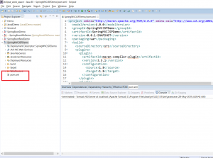

In this blog post, I will be explaining how to create a web project in Eclipse with Maven support.

# Create a Dynamic web project

Step 1 -Click on "File --> New --> Other"

Step 2 - Click on Dynamic Web Project

Step 3 - Type some project name

Step 4 - Click on Next

Step 5 - Click on "Next"

Step 6 - "Click on Finish". This will create a project as follows:

# Create web.xml

Sometimes, Eclipse may not automatically create the web.xml file. So if this file is not present in your web-inf folder, you need to follow these steps.

Step 1 - Right click on project --> Java JEE Tools --> Generate Deployment Descriptor Stub

This will create a web.xml file as follows:

# Add Maven Support

Step 1 - Right-click on Project --> Configure --> Convert to Maven Project

Step 2 - Click Finish

This will add a pom file to the project as follows:

Now you can add the necessary dependencies to your pom file. So for example, if you are creating a Spring application, you can add Spring dependencies.

You can also use this as a template to create any web application with Maven support.

**Further Reading**

- [Apache Maven Beginner to Guru](https://click.linksynergy.com/deeplink?id=MnzIZAZNE5Y&mid=39197&murl=https%3A%2F%2Fwww.udemy.com%2Fcourse%2Fapache-maven-beginner-to-guru%2F)
- [Maven Crash Course](https://click.linksynergy.com/deeplink?id=MnzIZAZNE5Y&mid=39197&murl=https%3A%2F%2Fwww.udemy.com%2Fcourse%2Fmavencrashcourse%2F)
- [Java Programming in Eclipse](https://click.linksynergy.com/deeplink?id=MnzIZAZNE5Y&mid=39197&murl=https%3A%2F%2Fwww.udemy.com%2Fcourse%2Feclipse-the-basic-java-programming-course%2F)
