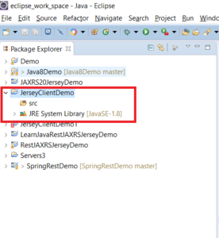
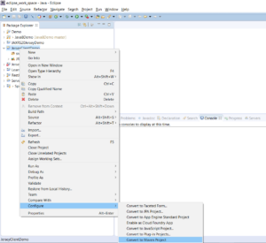
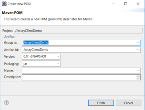
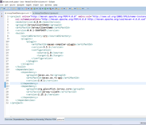
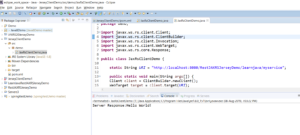

In this blog post, I will be demonstrating how you can create a JAX-RS client application using Jersey JAX-RS client implementation.

# What is JAX-RS and Jersey Client API?

JAX-RS is the Java specification for Restful web services. It is just a specification, it does not provide an implementation. Jersey is the reference implementation of JAX-RS specification. There are other implementations of JAX-RS like RESTEasy, etc  The first release of JAX-RS was JAX-RS 1.0. It did not provide a client API. So vendors like Jersey, RESTEasy provided their own client APIs. JAX-RS 2.0 (which is the latest release of JAX-RS) provides a client API. The latest release of Jersey (2.25.1) implements this client API. So in addition to its proprietary client API, Jersey also implements the JAX-RS client API.  While implementing a REST client that uses Jersey, it is better to use the JAX-RS specific client implementation and not Jersey's client API. So even if the JAX-RS vendor is changed from Jersey to something else like RESTEasy, the code will still work.

# How to create a JAX-RS client

## Project creation and configuration

Step 1 - Create a new Java Project in Eclipse (Refer to [this](https://learnjava.co.in/creating-a-basic-java-project-in-eclipse/) blog post). You should see a project as follows:



Step 2 - Convert to a Maven project.

 

Step 2a - Right Click on Project --> Configure --> Convert to Maven Project



 

Step 2b - Click on finish



 

Step 3 - Add Maven dependencies to POM file.

Add the following:

```
  <dependencies>
   <dependency>
    <groupId>javax.ws.rs</groupId>
    <artifactId>javax.ws.rs-api</artifactId>
    <version>2.0.1</version>
</dependency>
   <dependency>
    <groupId>org.glassfish.jersey.core</groupId>
    <artifactId>jersey-client</artifactId>
    <version>2.25.1</version>
</dependency>
  </dependencies>
```

So your POM file will look as follows:



## Write Code

Create a new Java class and write the following code:

```
public class JaxRsClientDemo {
  
  static String URI = "http://localhost:8080/RestJAXRSJerseyDemo/learnjava/myservice";

  public static void main(String args[]) {
  Client client = ClientBuilder.newClient();
  WebTarget target = client.target(URI);
  Invocation.Builder invocationBuilder = target.request();
  Response response = invocationBuilder.get();
  String responseStr = response.readEntity(String.class);
  System.out.println("Server Response:"+responseStr);
}
```

 

## Test code

Step 1 - Ensure that a REST service is running. Refer to [this](https://learnjava.co.in/how-to-create-a-rest-service-in-java-using-jax-rs-and-eclipse/) blog post.

Step 2 - Run the JaxRsClientDemo as a java program. This will produce the following output on the console:



You can download the source code for this at the GitHub repository [here](https://github.com/learnjavawithreshma/JerseyClientDemo).
