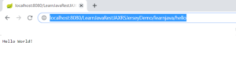

In this article, I will be demonstrating creating a REST service in Java using JAX-RS and Eclipse. I will be using Maven and Eclipse.

## Create a Project and And Maven Support

Step 1 – Follow the steps in [this](https://learnjava.co.in/how-to-create-a-maven-web-project-in-eclipse/) article to create a web project in Eclipse with Maven Support. You should see a project as follows:

[](images/1.png)

Step 2 - Add Maven dependencies for JAX-RS and Jersey as follows:

```
<dependency>
      <groupId>asm</groupId>
      <artifactId>asm</artifactId>
      <version>3.3.1</version>
    </dependency>
    <dependency>
      <groupId>com.sun.jersey</groupId>
      <artifactId>jersey-bundle</artifactId>
      <version>1.19.4</version>
    </dependency>
    <dependency>
      <groupId>org.json</groupId>
      <artifactId>json</artifactId>
      <version>20170516</version>
    </dependency>
    <dependency>
      <groupId>com.sun.jersey</groupId>
      <artifactId>jersey-server</artifactId>
      <version>1.19.4</version>
    </dependency>
    <dependency>
      <groupId>com.sun.jersey</groupId>
      <artifactId>jersey-core</artifactId>
      <version>1.19.4</version>
    </dependency>
```
## Modify web.xml

In the WebContent/WEB-INF/web.xml file, add the following content:

```
<servlet>
   <servlet-name>LearnJava JAX-RS Jersey Application</servlet-name>
   <servlet-class>com.sun.jersey.spi.container.servlet.ServletContainer</servlet-class>
   <load-on-startup>1</load-on-startup>
 </servlet>
 <servlet-mapping>
   <servlet-name>LearnJava JAX-RS Jersey Application</servlet-name>
   <url-pattern>/learnjava/*</url-pattern>
 </servlet-mapping>
```

## Add Code

Create a new class in src called HelloWorldService as follows:

```
@Path("/hello")
public class HelloWorldService {
  
  @GET
  @Produces("text/plain")
  public String getGreeting() {
    return "Hello World!";
  }
}
```

## Compile

Step 1 – Right Click on Project –> Run As –> Maven Build

Step 2 – If prompted, enter the goals as Clean Install

## Deploy

Step 1 - Setup Tomcat in Eclipse if nor already setup. Refer to [this](https://learnjava.co.in/how-to-setup-tomcat-in-eclipse/) blog post for detailed steps

Step 2 - Deploy your application to Tomcat. Refer to [this](https://learnjava.co.in/how-to-deploy-an-application-on-tomcat-server-in-eclipse/) blog post for detailed steps.

## Test

### Testing Via Browser

Open a browser window and type the following URL:

http://localhost:8080/LearnJavaRestJAXRSJerseyDemo/learnjava/hello

This will display the following page:

[](images/2.png)

## Conclusion

So this is how you can create a REST service in Java using JAX-RS and Eclipse.
