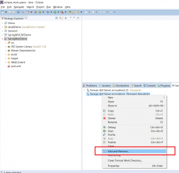
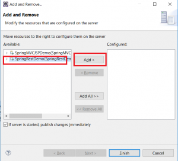
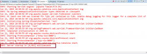

In this blog post, I will be demonstrating how to deploy an application to Tomcat in Eclipse. In order to deploy a Maven application in Tomcat in Eclipse, you can follow the same steps.

Step 1 - Setup Tomcat in Eclipse if not already setup. Refer to [this](https://learnjava.co.in/how-to-setup-tomcat-in-eclipse/) blog post for detailed steps

Step 2 - Right-click on "Tomcat Server" at the bottom and click Add/Remove:

Step 3 - Select Your project name and click "Add":

Step 4 - Click on Finish.

Step 5 - Start Tomcat by right-clicking and clicking on "Start". If the server starts successfully, you should see a message similar to the following in the console:

**Further Reading**

- [Fundamentals of Apache Tomcat](https://click.linksynergy.com/deeplink?id=MnzIZAZNE5Y&mid=39197&murl=https%3A%2F%2Fwww.udemy.com%2Fcourse%2Ffundamentals-of-apache-tomcat%2F)
- [Beginning with Eclipse IDE](https://click.linksynergy.com/deeplink?id=MnzIZAZNE5Y&mid=39197&murl=https%3A%2F%2Fwww.udemy.com%2Fcourse%2Fbeginners-eclipse-java-ide-training-course%2F)
- [Apache Tomcat Beginners to Advanced](https://click.linksynergy.com/deeplink?id=MnzIZAZNE5Y&mid=39197&murl=https%3A%2F%2Fwww.udemy.com%2Fcourse%2Fapache-tomcat-for-beginners-and-advanced%2F)
- [Java Programming in Eclipse](https://click.linksynergy.com/deeplink?id=MnzIZAZNE5Y&mid=39197&murl=https%3A%2F%2Fwww.udemy.com%2Fcourse%2Feclipse-the-basic-java-programming-course%2F)
