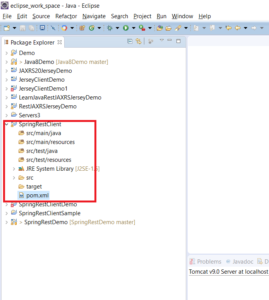

In this article, I will be demonstrating how you can create a Spring [REST](https://learnjava.co.in/rest/) client using RestTemplate. In order to see how you can create a simple Spring **REST** service, you can refer to [this](https://learnjava.co.in/how-to-create-a-spring-rest-application-via-maven-and-eclipse) blog post.

## What is Spring RESTTemplate?

Spring provides a class called **RestTemplate**. This is the starting point in creating a REST client application. It uses the URI and the HTTP method to invoke in order to connect to a REST service. It has several methods that allow you to invoke the HTTP methods on the specified URI

## Project Creation

Step 1 - Create a **Maven** Project in **Eclipse**. You can refer to [this](https://learnjava.co.in/how-to-create-a-maven-project-in-eclipse/) blog post. You will get a project as follows:




Step 2 - Add dependencies to POM file.

Add the following to your pom.xml file:

```
<properties>
    <spring.framework>5.1.3.RELEASE</spring.framework>
    <spring.web>5.1.3.RELEASE</spring.web>
  </properties>
  <dependencies>
    <dependency>
      <groupId>org.springframework</groupId>
      <artifactId>spring-core</artifactId>
      <version>${spring.framework}</version>
    </dependency>
    <dependency>
      <groupId>org.springframework</groupId>
      <artifactId>spring-context</artifactId>
      <version>${spring.framework}</version>
    </dependency>
    <dependency>
      <groupId>org.codehaus.jackson</groupId>
      <artifactId>jackson-mapper-asl</artifactId>
      <version>1.9.4</version>
    </dependency>
    <dependency>
      <groupId>org.springframework</groupId>
      <artifactId>spring-web</artifactId>
      <version>${spring.web}</version>
    </dependency>
  </dependencies>
```

## Code

### Server code

Before we write the client code, we need to have a REST service which the client will invoke. Refer to [this](https://learnjava.co.in/how-to-create-a-spring-rest-application-via-maven-and-eclipse) blog post in order to see how to create a simple REST service. Assume that we have a REST service as follows:

```
@RestController
public class HelloWorldController {
  @RequestMapping("/hello")
  public String helloWorld() {
 
    System.out.println("In HelloWorldController");
    String message = "Hello World";
    return message;
  }
}
```

### Writing Code

Step 3 - Create a Java class as follows:

```
public class DemoClient {
  
  final static String ROOT_URI = "http://localhost:8080/SpringRestDemo/hello";

  public static void main(String[] args) {
    RestTemplate restTemplate = new RestTemplate();
    ResponseEntity<String> response = restTemplate.getForEntity(ROOT_URI, String.class);
    System.out.println("Response is "+response.getBody());

  }

}

```

### Code Explanation

This code uses the `RestTemplate` class. It uses the `getForEntity`method.The `restTemplate.getForEntity` method accepts the **server URI** and a **class instance** of the data type that the server method returns. In this case, I'm using a `String.class`  since the service that is being invoked returns String data. It returns a `ResponseEntity`of the data type that the server application returns. We can then use the `responseEntity.getBody`method to retrieve the actual response body from the `ResponseEntity.`

Just like the **getForEntity**, there are other methods available on the RestTemplate which you can use to execute the other HTTP methods like **postForEntity**, put, etc.

### Testing

Step 4 - Ensure the Rest service is running at the **http://localhost:8080/SpringRestDemo/hello** URI.

Step 5 - Run the code. The following output should be seen on the console.

```
Response is Hello World
```

## Further Learning

[Spring MasterClass](https://click.linksynergy.com/deeplink?id=MnzIZAZNE5Y&mid=39197&murl=https%3A%2F%2Fwww.udemy.com%2Fcourse%2Fjava-spring-framework-masterclass%2F) [Spring Tutorial For Beginners](https://click.linksynergy.com/deeplink?id=MnzIZAZNE5Y&mid=39197&murl=https%3A%2F%2Fwww.udemy.com%2Fcourse%2Fspring-tutorial-for-beginners%2F) [Step by Step Spring MVC Tutorial](https://click.linksynergy.com/deeplink?id=MnzIZAZNE5Y&mid=39197&murl=https%3A%2F%2Fwww.udemy.com%2Fcourse%2Fspring-mvc-tutorial-for-beginners-step-by-step%2F) [Spring Framework in Easy Steps](https://click.linksynergy.com/deeplink?id=MnzIZAZNE5Y&mid=39197&murl=https%3A%2F%2Fwww.udemy.com%2Fcourse%2Fspringframeworkineasysteps%2F)

## Conclusion

In this article, you saw how to create a Spring REST client using Eclipse and Maven. You saw how the Spring RESTTemplate example can be used to execute a GET Request.

You can download the complete source code from the Github repository [here](https://github.com/learnjavawithreshma/SpringRestClient).
