In this article, I will be covering how to set up the Pydev plugin in Eclipse. Pydev is the Python plugin for Eclipse. It helps you to write Python code using Eclipse.

**Step 1 - Download Python**

Download the latest version of Python from https://www.python.org/downloads/ as per your operating system. You should get a file as follows:

[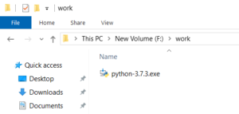](https://learnjava.co.in/wp-content/uploads/2019/12/DownloadPython.png)

**Step 2 - Install Python**

1. Double click the downloaded executable file (file with .exe extension). Click Customize Installation

[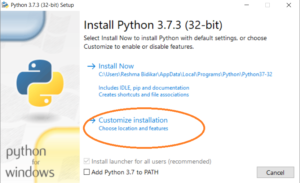](https://learnjava.co.in/wp-content/uploads/2019/12/InstallPython1-1.png)

2\. This will show the following screen. Click next:

[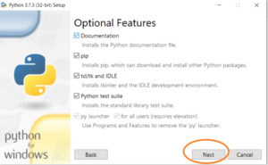](https://learnjava.co.in/wp-content/uploads/2019/12/InstallPython2-1.png)

3\. This will show the following screen. Choose the appropriate path for installation. Click Install

[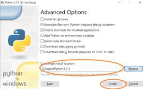](https://learnjava.co.in/wp-content/uploads/2019/12/InstallPython4-1.png)

 

4\. Installation process will start as follows:

[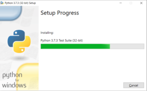](https://learnjava.co.in/wp-content/uploads/2019/12/InstallPython5.png)

 

5\. The following screen will be displayed once the installation is complete. Click Close

[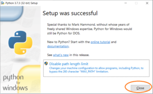](https://learnjava.co.in/wp-content/uploads/2019/12/InstallPython6-1.png)

**Step 3 - Configure Pydev**

Open Eclipse. Click on Help -> Eclipse MarketPlace.

[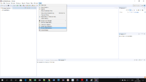](https://learnjava.co.in/wp-content/uploads/2019/12/Pydev1.png)

This will display the following screen:

[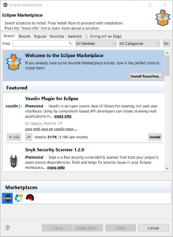](https://learnjava.co.in/wp-content/uploads/2019/12/Pydev2.png)

Type Pydev in the Search box & click on Go:

 

This will display the following. Click the install button next to Pydev:

This will display the following. Click the confirm button:

[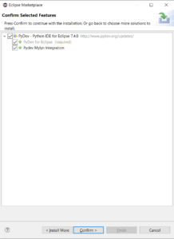](https://learnjava.co.in/wp-content/uploads/2019/12/pydev5.png)

This will display the following:

[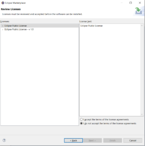](https://learnjava.co.in/wp-content/uploads/2019/12/pydev6.png)

Accept the license agreement and click on Finish. This will prompt you to restart Eclipse.

**Configure Pydev**

Click on Window --> Preferences:

[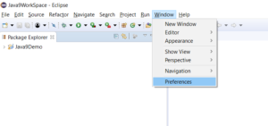](https://learnjava.co.in/wp-content/uploads/2019/12/ConfigurePydev1.png)

This will display the following screen:

[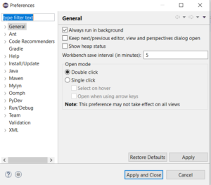](https://learnjava.co.in/wp-content/uploads/2019/12/ConfigurePydev2.png)

Expand Pydev --> Interpreters and click on Python interpreter:

[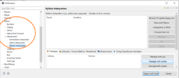](https://learnjava.co.in/wp-content/uploads/2019/12/ConfigurePydev3.png)

Click on Browse for python/pypye.exe:

[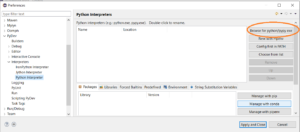](https://learnjava.co.in/wp-content/uploads/2019/12/ConfigurePydev3a.png)

Browse for the path of your Python exe:

[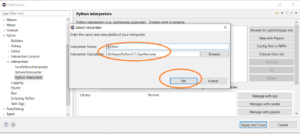](https://learnjava.co.in/wp-content/uploads/2019/12/ConfigurePydev4-1.png)

This will display the following screen. Click apply and close:

[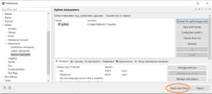](https://learnjava.co.in/wp-content/uploads/2019/12/ConfigurePydev6.png)

You are now ready to start creating your first python program in Eclipse!!

## Further Learning

[The Python Masterclass](https://click.linksynergy.com/deeplink?id=MnzIZAZNE5Y&mid=39197&murl=https%3A%2F%2Fwww.udemy.com%2Fcourse%2Fpython-the-complete-python-developer-course%2F) [Everything you need to know about Python](https://click.linksynergy.com/deeplink?id=MnzIZAZNE5Y&mid=39197&murl=https%3A%2F%2Fwww.udemy.com%2Fcourse%2Fthe-python-bible%2F) [Python for beginners](https://click.linksynergy.com/deeplink?id=MnzIZAZNE5Y&mid=39197&murl=https%3A%2F%2Fwww.udemy.com%2Fcourse%2Fpython-programming-projects%2F) [Python for finance](https://click.linksynergy.com/deeplink?id=MnzIZAZNE5Y&mid=39197&murl=https%3A%2F%2Fwww.udemy.com%2Fcourse%2Fpython-for-finance-investment-fundamentals-data-analytics%2F)
