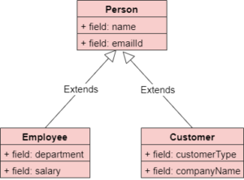
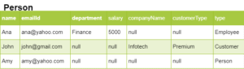
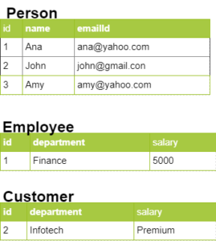
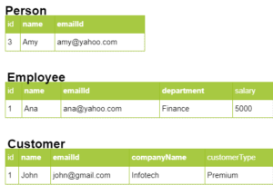
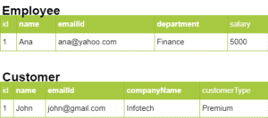

**Java** is inherently an **object-oriented** language. **Databases** are **relational** in nature. JPA/Hibernate support **Inheritance strategies**. These allow mapping Java class hierarchies to database tables. In this article, I will be covering inheritance strategies supported by JPA/Hibernate.

## Introduction

JPA/Hibernate support 4 inheritance strategies, **Single Table**, **Joined**, **Table Per Sub-class** and **MappedSuperClass**. In this article, I will be covering each inheritance strategy and how it works.

## Sample Code

Consider the following class diagram:

\[caption id="attachment\_2022" align="alignnone" width="300"\] Inheritance\_strategies\_class\_diagram\[/caption\]

 

Here _Person_ is a super class. It has two sub-classes, _Employee_ and _Customer_. Let us see how each of these strategies work for the above class hierarchy.

## Single Table

This strategy is also known as **table per hierarchy**. In this strategy, JPA creates a **single table** corresponding to all the classes in the inheritance hierarchy. This table has columns corresponding to the fields in all the classes in the hierarchy.  So in this example, the table will have columns corresponding to the fields in _Person_, _Employee_ and Customer classes.

Each record uses only a subset of the columns corresponding to the underlying entity that it represents and sets a **null** value for the other columns. So an _Employee_ record will only use the columns _name_, _emailId_, _department_, _salary_. It will have null values for _customerType_ and _companyName_ fields_._

In addition, JPA adds an additional column to the table. This is known as the **discriminator** column. This differentiates between the records.

So for the class structure above, JPA creates the following table:

## Joined

In this strategy, JPA creates **separate tables** corresponding to each class in the inheritance hierarchy. The table corresponding to the base class has columns corresponding to the fields in the base class. So here, the _Person_ table will have fields corresponding to _name_ and _emailId_.

The tables corresponding to the sub classes has columns corresponding to the fields in the sub classes. So here the _Employee_ table has fields corresponding to the _department_ and _salary_. The _Customer_ table will have fields corresponding to _companyName_ and _customerType_,

For a base class record, JPA stores all the data in the base class table. For a sub-class record, JPA stores the common fields in the base class table and the individual fields in the sub-class tables.

So for the class structure above, JPA creates the following table structure:

## Table Per Sub-Class

In this strategy, JPA creates **separate tables** corresponding to each class in the inheritance hierarchy.

The table corresponding to the base class has columns corresponding to the fields in the base class. So here, the _Person_ table will have fields corresponding to _name_ and _emailId_.

The tables corresponding to the sub classes have columns corresponding to the fields base class well as fields in the sub classes. So here the _Employee_ table has fields corresponding to _name_, _emailId,_ _department_ and _salary_. The _Customer_ table will have fields corresponding to _name_, _emailId,_ _companyName_ and _customerType_,

For any entity, JPA stores data in the corresponding table.

So for the class structure above, JPA creates the following table structure:

## MappedSuperClass

In this strategy, JPA creates **separate tables** corresponding to each **sub-class** in the inheritance hierarchy. The sub class tables have columns corresponding to the fields base class well as fields in the sub classes.

This is similar to table per sub-class except that superclass is not an entity and there is no table corresponding to the superclass. So in this case, JPA does not create a table corresponding to the Person class, it only creates tables corresponding to Employee and Customer.

The _Employee_ table has fields corresponding to _name_, _emailId,_ _department_ and _salary_. The _Customer_ table will have fields corresponding to _name_, _emailId,_ _companyName_ and _customerType._

So for the class structure above, JPA creates the following table structure:

 

I will be demonstrating how to implement each of these strategies in subsequent articles.

\[table id=30 /\]

## Further Learning

[Master JPA and Hibernate with Spring Boot](https://click.linksynergy.com/deeplink?id=MnzIZAZNE5Y&mid=39197&murl=https%3A%2F%2Fwww.udemy.com%2Fcourse%2Fhibernate-jpa-tutorial-for-beginners-in-100-steps%2F) [Spring Data JPA with Hibernate](https://click.linksynergy.com/deeplink?id=MnzIZAZNE5Y&mid=39197&murl=https%3A%2F%2Fwww.udemy.com%2Fcourse%2Fspring-data-jpa-using-hibernate%2F) [Hibernate and JPA Fundamentals](https://click.linksynergy.com/deeplink?id=MnzIZAZNE5Y&mid=39197&murl=https%3A%2F%2Fwww.udemy.com%2Fcourse%2Fhibernate-and-java-persistence-api-jpa-fundamentals%2F)

## Conclusion

So in this article, we saw the JPA/Hibernate inheritance mapping strategies. We understood the Single Table, Joined, Table per class and MappedSuperClass hierarchies and the table structures that they create.
