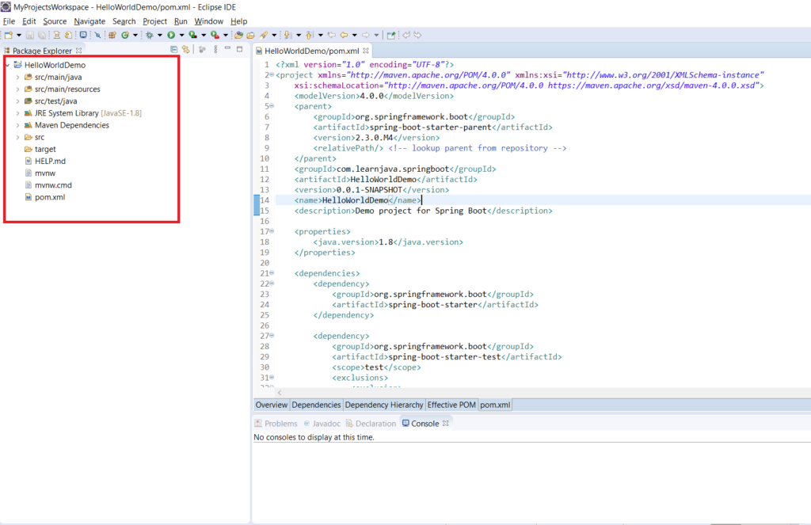

The Spring Initializr is a web-based service that can help you get started with [Spring Boot](https://click.linksynergy.com/deeplink?id=MnzIZAZNE5Y&mid=39197&murl=https%3A%2F%2Fwww.udemy.com%2Fcourse%2Fspring-boot-tutorial-for-beginners%2F) easily. In this article, I will be explaining what Spring Initializr is and how you can you it.

\[table id=25 /\]

## What is Spring Initializr?

The Spring Initializr is a web-based service provided by the makes of Spring. You can access it from [https://start.spring.io/.](https://start.spring.io/) 

This helps you create a ready to use project structure for a basic Spring Boot application. You can directly use this project structure and add your code.

 

## How to use Spring Initializr?

First, you need to select the appropriate values and create the project structure. Next, you need to use the project structure in your IDE.

### Creating Project Structure

**Step 1** - Go to [https://start.spring.io/](https://start.spring.io/). You will see a screen as follows:

**Step 2** - Select values for the type of project, programming language and Spring Boot version. Here, I will be creating a [Maven Project](https://click.linksynergy.com/deeplink?id=MnzIZAZNE5Y&mid=39197&murl=https%3A%2F%2Fwww.udemy.com%2Fcourse%2Fapache-maven-beginner-to-guru%2F) in Java with 2.3.0 version of Spring Boot. So I will select the following:

**Step 3** - Customize the project metadata. So I've set the values as follows: I've also selected "Java 8" as the Java version:

**Step 4** - You can also add some dependencies if you want as follows.

**Step 4a** - Click the add dependencies button as follows:

 

**Step 4b** - This displays the following screen. Here you can click on the necessary dependencies:

**Step 4c** -  Once you click on the dependency, it will show the following screen. So here, I've selected the "**Spring-web**" dependency:

 

**Step 5** - Finally, click the "**Generate**" button. This will download the project structure for you:

\[table id=26 /\]

### Using the Project Structure

**Step 1** - Unzip the downloaded file into any folder. It will display the following project structure:

**Step 2** - Import this as a Maven project in your IDE. I am using Eclipse. So this creates an Eclipse project as follows. The pom file has some default dependencies as well as the additionally selected dependencies:

A demo application is also created for you as follows:

**Step 3** - Add your code. Let's add a REST controller that returns "Hello World":

**Step 4 -** Run the "HelloWorldDemoApplication" as a Java application:

**Step 5** - Open a browser window and type "http://localhost:8080/hello". This displays the following:

\[table id=30 /\]

## Conclusion

So in this article, we saw how to use Spring Initializr. We saw how Spring Initializr creates a ready to use project structure that you can use in your application
