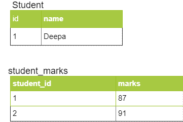
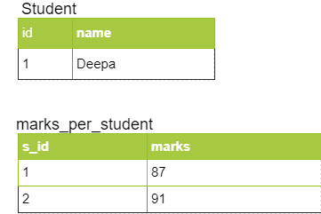

In my [earlier](https://learnjava.co.in/hibernate-collection-mapping/) article, I gave an introduction to Hibernate Collection mapping. In this article, I will be covering how you can use this feature to map a List or Set to a database table.

## When to use Collection Mapping

Sometimes, your entity may have a field which is a Collection of primitive types. You may want to store these values in the database. In such a case, you cannot use a OneToMany association since the target Collection has primitive values. The Collection Mapping feature is useful in such scenarios.

## @ElementCollection annotation

Just to recap my [earlier](https://learnjava.co.in/hibernate-collection-mapping/) article, Hibernate/JPA supports the @ElementCollection annotation. You need to specify this annotation on the Collection that you want to persist to the database.

Consider the following `Student`class:

```
@Entity
public class Student {
  
  @Id
  @GeneratedValue(strategy=GenerationType.IDENTITY)
  private int id;
  private String name;
  
  @ElementCollection
  private List<Integer> marks;

        //getters and setters
}


```

- The **Student** class has fields corresponding to **id** and **name**.
- It also has a **marks** field that corresponds to the marks of that **Student**.
- The **marks** field is a **List** of Integer values. It can also be of type **Set**
- The **@ElementCollection** annotation is specified on the **marks** field.

## Saving an Entity with a Collection

Once the field in the entity is marked with the `@ElementCollection`annotation, you simply need to invoke the `save`method on the entity. This will cause a separate table to be created corresponding to the values in the Collection. The following code demonstrates this:

```
public class Main {

  public static void main(String args[]) {
    SessionFactory sessionFactory = HibernateUtil.getSessionFactory();
    Session session = sessionFactory.openSession();
    Transaction tx = session.beginTransaction();
    Student student = new Student("Deepa");
    List<Integer> marks = Arrays.asList(87,91);
    student.setMarks(marks);
    session.save(student);
    tx.commit();
    session.close();
    HibernateUtil.closeSessionFactory();
  }

}
```

- This code creates a **Student** object.
- It also creates an Integer List corresponding to **marks** and sets them in the **Student** object.
- Finally, it invokes **session.save** on the **Student** object.

When you execute this code, it creates tables as follows:

[](https://learnjava.co.in/wp-content/uploads/2020/06/CollectionMappingTable-1.png)

## CollectionTable

You can customize the name of the table storing the Collection via the @CollectionTable annotation. You can also customize the name of the id column. The following code demonstrates this:

```
@Entity
public class Student {
  
  @Id
  @GeneratedValue(strategy=GenerationType.IDENTITY)
  @Column(name="id")
  private int id;
  private String name;
  
  @ElementCollection
  @CollectionTable(name = "MARKS_PER_STUDENT", joinColumns = @JoinColumn(name = "S_ID"))
  private List<Integer> marks;

}
```

- In addition to **@ElementCollection**, the code also specifies the **@CollectionTable** annotation on the marks field
- It specifies the **name** attribute with the value "**MARKS\_PER\_STUDENT**". So the name of the table having the Collection values will be **MARKS\_PER\_STUDENT**
- It specifies the **@JoinColumn** attribute with the value "**S\_ID**". So the name of the **id** column in the Collection Table will be **S\_ID**

So when you save a Student object, this code creates the following table:

[](https://learnjava.co.in/wp-content/uploads/2020/06/CollectionMappingCollectionTable.png)

## Further Learning

[Master JPA and Hibernate with Spring Boot](https://click.linksynergy.com/deeplink?id=MnzIZAZNE5Y&mid=39197&murl=https%3A%2F%2Fwww.udemy.com%2Fcourse%2Fhibernate-jpa-tutorial-for-beginners-in-100-steps%2F) [Spring Data JPA with Hibernate](https://click.linksynergy.com/deeplink?id=MnzIZAZNE5Y&mid=39197&murl=https%3A%2F%2Fwww.udemy.com%2Fcourse%2Fspring-data-jpa-using-hibernate%2F) [Hibernate and JPA Fundamentals](https://click.linksynergy.com/deeplink?id=MnzIZAZNE5Y&mid=39197&murl=https%3A%2F%2Fwww.udemy.com%2Fcourse%2Fhibernate-and-java-persistence-api-jpa-fundamentals%2F)

## Conclusion

So in conclusion, Hibernate/JPA supports the `@ElementCollection` annotation. You can use it to map a **Collection** to a database without having to use the `@OneToMany` annotation and creating a separate entity. In this article, we saw how you can use the `@ElementCollection` annotation to map a **List** of primitive values to a database table. In subsequent articles, I will be demonstrating how you can use `@ElementCollection` annotation to map a Collection of non-primitive types.
