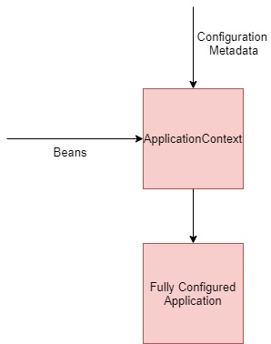

In my [earlier article](https://learnjava.co.in/spring-framework-what-and-why/), I gave an introduction to Spring. I covered how the [Spring Framework](https://click.linksynergy.com/deeplink?id=MnzIZAZNE5Y&mid=39197&murl=https%3A%2F%2Fwww.udemy.com%2Fcourse%2Fspring-tutorial-for-beginners%2F) helps in wiring together the objects used in an application. In this article, I will be covering how exactly spring achieves this.

## Introduction

Just to [recap](https://learnjava.co.in/spring-framework-what-and-why/), the Spring framework consists of the Spring container. The Spring Container is responsible for creating the objects required in an application and providing them to the necessary classes.  It uses Inversion of Control via Dependency Injection to achieve this. Let us now see how exactly this happens.

## High Level Overview

In order for Spring to be able to wire up the application, it requires developers to provide the following:

- Beans - The objects in an application are known as beans in Spring terminology. These are simple POJO classes. Spring configures objects of these classes
- Configuration metadata - Information on how to instantiate the beans and wire them together.

The Spring container is also known as the **Spring Application Context**. It is responsible for creating and managing the objects in an application.The following diagram illustrates how the Application context uses the beans and the configuration metadata to create a ready to use application:

[](https://learnjava.co.in/wp-content/uploads/2020/03/Spring.png)

## Beans

As explained earlier, the beans in a Spring application are the actual objects that need to be configured. They are simple POJO classes. In order for Spring to be instantiate the beans, the POJO classes need to provide setter methods or constructors. The Spring container injects dependencies via the setter methods or constructors. In other words, the Spring container invokes the setter methods or constructors to initialize the bean.

### **Setter injection**

The following code demonstrates a bean having a setter method:

```
public class MessageService {
  
  private MessageDAO messageDAO;

  public MessageDAO getMessageDAO() {
    return messageDAO;
  }

  public void setMessageDAO(MessageDAO messageDAO) {
    this.messageDAO = messageDAO;
  }
  
  public void printMessage() {
    String message = messageDAO.getMessage();
    System.out.println(message);
  }

}
```

Here, the `MessageService`bean uses the `MessageDAO`. It has a setter method for `MessageDAO`. So when creating the`MessageService`, the Spring container also initializes the `messageDAO`bean by invoking the setter method.

### **Constructor injection**

The following code demonstrates a bean having a constructor:

```
public class MessageService {
  
  private MessageDAO messageDAO;
  
  public MessageService(MessageDAO messageDAO) {
    this.messageDAO = messageDAO;
  }

  public void printMessage() {
    String message = messageDAO.getMessage();
    System.out.println(message);
  }
}
```

Here, the `MessageService`bean has a constructor that initializes the `messageDAO`.So when creating the`MessageService`bean. the Spring container also initializes the `messageDAO`bean by invoking the constructor.

## Configuration metadata

In addition to creating beans with setter methods/constructors, an application needs to provide the configuration metadata. Configuration metadata simply means information about the dependencies, that is the beans required by a particular bean.

There are three ways in which the configuration metadata can be provided:

**XML Configuration -** In this approach, an application needs to provide an XML file that has information about the beans and their relationship with other beans. [This](https://learnjava.co.in/spring-xml-configuration-example/) article provides an example of configuring a standalone Spring application using XML configuration.

**Java Configuration -** In this approach, XML file is not used. Instead, the configuration metadata is specified in a Java file. The Java file needs to have the @Configuration annotation. [This](https://learnjava.co.in/spring-java-configuration-example/) article provides an example of configuring a standalone Spring application using XML configuration.

**Annotations** - In this approach, annotations are specified in the beans in the application. These annotations hold the configuration information. Annotations like @Service, @Repository need to be specified. [This](https://learnjava.co.in/spring-annotation-configuration-example/) article provides an example of configuring a standalone Spring application using XML configuration.

## Further Learning

[Spring MasterClass](https://click.linksynergy.com/deeplink?id=MnzIZAZNE5Y&mid=39197&murl=https%3A%2F%2Fwww.udemy.com%2Fcourse%2Fjava-spring-framework-masterclass%2F) [Spring Tutorial For Beginners](https://click.linksynergy.com/deeplink?id=MnzIZAZNE5Y&mid=39197&murl=https%3A%2F%2Fwww.udemy.com%2Fcourse%2Fspring-tutorial-for-beginners%2F) [Step by Step Spring MVC Tutorial](https://click.linksynergy.com/deeplink?id=MnzIZAZNE5Y&mid=39197&murl=https%3A%2F%2Fwww.udemy.com%2Fcourse%2Fspring-mvc-tutorial-for-beginners-step-by-step%2F) [Spring Framework in Easy Steps](https://click.linksynergy.com/deeplink?id=MnzIZAZNE5Y&mid=39197&murl=https%3A%2F%2Fwww.udemy.com%2Fcourse%2Fspringframeworkineasysteps%2F)

## Conclusion

So in this article, we saw how Spring works under the hood to provide a wiring mechanism. We understood what Spring beans are and how an application needs to supply configuration metadata. We then saw how Spring uses this information to configure an application.
