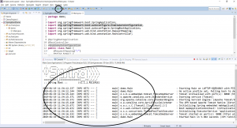

In this blog post, I will be explaining how you can create a Hello World Spring Boot application in Eclipse using Maven.

## What is Spring Boot?

Spring boot sits on top of Spring. It automatically does the configuration of the application for you by assuming some defaults. These defaults are sufficient to get you started most of the times but you easily change these default values if required. This allows you to have a spring application up and running very quickly without having to bother with boiler plate stuff. All you have to do is tell Spring boot the type of application you are building. It provides Embedded HTTP servers like Tomcat, Jetty etc. which makes it easy to develop web applications. In order to know more about Spring Boot, you can refer to [this](https://learnjava.co.in/springboot-what-and-why/) blog post.

## Creating Hello World Spring Boot Application

Let us now learn how to create a basic Hello World Spring Boot application in Eclipse using Maven

### Project Creating and setup

**Step 1 – Create a new Maven Project** (Refer to [this](https://learnjava.co.in/how-to-create-a-maven-project-in-eclipse/) blog post). Your project should look as follows:

[](images/FinishedMavenProject.png)

**Step 2 - Add the Spring Boot dependencies to the POM file.** Your POM file should look similar to the following:

```
<project xmlns="http://maven.apache.org/POM/4.0.0" xmlns:xsi="http://www.w3.org/2001/XMLSchema-instance" xsi:schemaLocation="http://maven.apache.org/POM/4.0.0 http://maven.apache.org/xsd/maven-4.0.0.xsd">
  <modelVersion>4.0.0</modelVersion>
  <groupId>com.learnjava</groupId>
  <artifactId>SpringBootDemo</artifactId>
  <version>0.0.1-SNAPSHOT</version>
  
  	<parent>
    <groupId>org.springframework.boot</groupId>
    <artifactId>spring-boot-starter-parent</artifactId>
    <version>2.1.2.RELEASE</version>
  </parent>
  <dependencies>
  <dependency>
    <groupId>org.springframework.boot</groupId>
    <artifactId>spring-boot-starter-web</artifactId>
  </dependency>
  </dependencies>
</project>
```

Spring Boot provides a number of 'starters' that add the necessary jar files to the classpath. Here we are using the following starters:

- **spring-boot-starter-parent** - This provides useful Maven defaults.
- **spring-boot-starter-web** - This tells Spring Boot that we are developing a web application.

In order to know more about Spring Boot starters, you can refer to [this](https://learnjava.co.in/springboot-what-and-why/#SpringBoot_components) blog post.

### Writing Code

**Step 3** - Create **Main.java** in **demo** package as follows:

```
package demo;

import org.springframework.boot.SpringApplication;
import org.springframework.boot.autoconfigure.EnableAutoConfiguration;
import org.springframework.boot.autoconfigure.SpringBootApplication;
import org.springframework.web.bind.annotation.RequestMapping;
import org.springframework.web.bind.annotation.RestController;

@SpringBootApplication
public class Main {

  public static void main(String[] args) {
    SpringApplication.run(Main.class, args);
  }
}

```

- The **Main** class has the [**@SpringBootApplication**](2021/01/springbootapplication-annotation-explained.md) annotation.
- It simply invokes the **SpringApplication.run** method. This starts the Spring application as a standalone application, runs the embedded servers and loads the beans.

**Step 4** - Create **HelloWorldController** in **demo.controller** package as follows:

```
package demo.controller;

import org.springframework.web.bind.annotation.RequestMapping;
import org.springframework.web.bind.annotation.RestController;

@RestController
public class HelloWorldController {
  
  @RequestMapping("/")
  String home() {
    return "Hello World!";
  }
}

```

- The **HelloWorldController** class has the [@RestController](https://learnjava.co.in/important-spring-mvc-annotations/#RestController) annotation. This designates the class as a REST controller, i.e. a controller that handles REST requests.
- It has a **home** method with the [@RequestMapping](https://learnjava.co.in/important-spring-mvc-annotations/#RequestMapping) annotation. This specifies that the **hello** method maps to the **/hello** path. It simply returns the String **"Hello World!"**

## Running the application

**Step 5 - Run Main.java as a Java application** as shown below:

[](images/run-main.png)

This should display the console output as highlighted below:

[](images/run.png)

Step 6 - Check in the browser. Open a browser window and type **http://localhost:8080/hello**

[](images/running-app.png)

So you have your Spring Boot application up and running!

You can download the source code for this project from the GitHub repository [here](https://github.com/learnjavawithreshma/SpringBootDemo).
