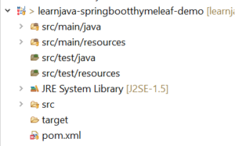
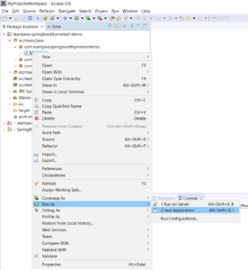
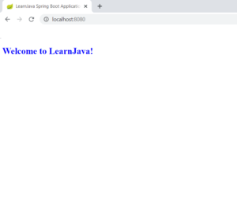
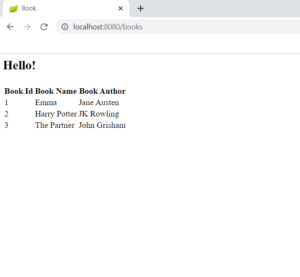

In this article, I will be demonstrating creating a Spring Boot Thymeleaf web application.

## Project Creation and Setup

**Step 1 – Create a new Maven Project** (Refer to [this](https://learnjava.co.in/how-to-create-a-maven-project-in-eclipse/) blog post). This should create a project as shown below:

[](https://learnjava.co.in/wp-content/uploads/2021/03/basic_project.png)

**Step 2 – Add the Spring Boot and Thymeleaf dependency**. So, the **pom.xml** file should be similar to the following:

```
<project xmlns="http://maven.apache.org/POM/4.0.0"
  xmlns:xsi="http://www.w3.org/2001/XMLSchema-instance"
  xsi:schemaLocation="http://maven.apache.org/POM/4.0.0 https://maven.apache.org/xsd/maven-4.0.0.xsd">
  <modelVersion>4.0.0</modelVersion>
  <groupId>com.learnjava</groupId>
  <artifactId>learnjava-springbootthymeleaf-demo</artifactId>
  <version>0.0.1-SNAPSHOT</version>
  <parent>
    <groupId>org.springframework.boot</groupId>
    <artifactId>spring-boot-starter-parent</artifactId>
    <version>2.1.2.RELEASE</version>
  </parent>
  <dependencies>
    <dependency>
      <groupId>org.springframework.boot</groupId>
      <artifactId>spring-boot-starter-web</artifactId>
    </dependency>
    <dependency>
      <groupId>org.springframework.boot</groupId>
      <artifactId>spring-boot-starter-thymeleaf</artifactId>
    </dependency>
  </dependencies>

</project>
```

## Writing Simple Code

**Step 3 - Creating a Controller class**

Let us first create a simple controller that displays a static html page without any data:

```
package com.learnjava.springbootthymeleafdemo.welcome;

import org.springframework.stereotype.Controller;
import org.springframework.web.bind.annotation.GetMapping;

@Controller
public class WelcomeController {

  @GetMapping("/")
  public String showHome() {
    return "home";
  }

}
```

- The `WelcomeController` class has the [@Controller](https://learnjava.co.in/important-spring-mvc-annotations/#Controller) annotation. This designates the class as an MVC controller.
- It has a `showHome`method.  The [GetMapping](https://learnjava.co.in/important-spring-mvc-annotations/#GetMapping) annotation specifies that this maps to the **"/"** path.
- It simply returns the String **hello**. This specifies the name of the Thymeleaf template (an html file) that needs to be displayed.

**Step 4 - Creating the Thymeleaf template file**

As seen earlier, the controller returns the name of the Thymeleaf template.  An HTML file with this name needs to be present in a **templates** folder within the **src/main/resources** folder. So, we need to create **home.html** within the **src/main/resources/templates** folder as follows:

```
<!DOCTYPE html>
<html>
   <head>
      <title>LearnJava Spring Boot Application</title>
       <link href = "css/style.css" rel = "stylesheet"/>
   </head>
   <body>
      <h2>Welcome to LearnJava!</h2>
   </body>
</html>
```

- This is a simple html file that displays a message
- It references the **style.css**.

**Step 5 - Creating CSS file**

The Thymeleaf template can optionally refer a CSS file as done above. In such cases, the specified CSS file needs to be present in a **static** folder within the **src/main/resources** folder. So, we need to create **style.css** within the **src/main/resources/static** folder as follows:

```
h2 {
   color: blue;
}
```

- This is a simple CSS file that displays H2 headings in blue colour.

## Running the application

**Step 6 – Run Main.java as a Java application** as shown below:

[](https://learnjava.co.in/wp-content/uploads/2021/03/run_java_application.png)

 

**Step 7 – Open http://localhost:8080/ in browser**. This displays the following output:

[](https://learnjava.co.in/wp-content/uploads/2021/03/Output-1.png)

 

## Some More Code

Most real-world applications require to do more complex things than display a simple message. Let us write some more code that displays data in a tabular form.

**Step 8 - Create a Book class as follows:**

```
public class Book {

  private int id;
  private String name;
  private String author;

     // constructor, getters and setters

}
```

- The `Book` class has fields corresponding to `id`, `name`and `author`

**Step 9 - Create a BookController class as follows:**

```
import java.util.ArrayList;
import java.util.List;

import org.springframework.beans.factory.annotation.Value;
import org.springframework.stereotype.Controller;
import org.springframework.ui.Model;
import org.springframework.web.bind.annotation.GetMapping;

@Controller
public class BookController {
  
  @Value("${greeting}")
  private String greeting;
  
   @GetMapping("/books")
    public String getAllBooks(Model model){
      //Returns hardcoded data, a real world application would return from the database
      List<Book> books = new ArrayList<Book>();
      books.add(new Book(1,"Emma", "Jane Austen"));
      books.add(new Book(2,"Harry Potter", "JK Rowling"));
      books.add(new Book(3,"The Partner", "John Grisham"));
      model.addAttribute("books", books);
      model.addAttribute("greeting",greeting);
      return "books";
    } 

}
```

- The `BookController` class has a `greeting`field. It has the `@Value` annotation with the value **$greeting.** This value can be set in the **application.properties** file as explained below.
- The `BookController` class also has a `getAllBooks`method.  This maps to the **"/books"** path as specified via the [GetMapping](https://learnjava.co.in/important-spring-mvc-annotations/#GetMapping) annotation.
- It accepts a Model object as a parameter. In [Spring](https://click.linksynergy.com/deeplink?id=MnzIZAZNE5Y&mid=39197&murl=https%3A%2F%2Fwww.udemy.com%2Fcourse%2Fspring-tutorial-for-beginners%2F), A Model represents the data to be sent to the front-end.
- Next, the `getAllBooks`method creates a List of `Book` objects and sets it as a Model attribute. In a typical Spring Boot application, data is retrieved via [Spring Data JPA](https://click.linksynergy.com/deeplink?id=MnzIZAZNE5Y&mid=39197&murl=https%3A%2F%2Fwww.udemy.com%2Fcourse%2Fspring-data-jpa-using-hibernate%2F) as demonstrated [here](https://learnjava.co.in/springboot-jpa-example-with-eclipse-and-maven/).
- Similarly, it also sets the `greeting` field as a Model attribute.
- Thus, any data that needs to be sent to the HTML template, needs to be set as as model attribute like this.
- Finally, it returns the String **books**. This specifies the name of the Thymeleaf template.

**Step 10 - Defining a greeting property**

The `BookController` class has a `greeting` field. The @Value annotation assigns it a value via $greeting. Such properties need to be defined in an  **application.properties** file within the **src/main/resources** folder. So, we need to create **src/main/resources/****application.properties** as follows:

```
greeting=Hello!
```

**Step 11 - Creating books.html**

Just like **home.html,** we need to create **books.html** within the **src/main/resources/templates** folder as follows:

```
<html>
<head>
<title>Book</title>
</head>
<body>
<H2> <p th:text="${greeting}"></p></H2>
<table>
  <thead>
    <tr>
      <th>Book Id</th>
      <th>Book Name</th>
      <th>Book Author</th>
    </tr>
  </thead>
  <tbody>
    <tr th:each="book : ${books}">
      <td th:text="${book.id}"></td>
      <td th:text="${book.name}"></td>
      <td th:text="${book.author}"></td>
    </tr>
  </tbody>
</table>
</body>
</html>
```

- _th:text_ is used to refer to the **$greeting** value
- _th:each_ is used to iterate through the **books** list
- _th:text_ is used to obtain the value of each **book** field

**Step 12 - Run the application and type http://localhost:8080/books in a browser.** This displays the following output:

[](https://learnjava.co.in/wp-content/uploads/2021/03/spring-boot-thymeleaf-Output2.png)

You can download the complete source code from the GitHub Repository [here](https://github.com/reshmabidikar/learnjava-springbootthymeleaf-demo).

## Further Learning

[Mastering Thymeleaf with Spring Boot](https://click.linksynergy.com/deeplink?id=MnzIZAZNE5Y&mid=39197&murl=https%3A%2F%2Fwww.udemy.com%2Fcourse%2Fmastering-thymeleaf-with-spring%2F) [Spring Boot Tutorial for beginners](https://click.linksynergy.com/deeplink?id=MnzIZAZNE5Y&mid=39197&murl=https%3A%2F%2Fwww.udemy.com%2Fcourse%2Fspring-boot-tutorial-for-beginners%2F) [Spring Boot Fundamentals](https://click.linksynergy.com/deeplink?id=MnzIZAZNE5Y&mid=39197&murl=https%3A%2F%2Fwww.udemy.com%2Fcourse%2Fspringbootfundamentals%2F) [Spring 5 with Spring Boot](https://click.linksynergy.com/deeplink?id=MnzIZAZNE5Y&mid=39197&murl=https%3A%2F%2Fwww.udemy.com%2Fcourse%2Fspring-5-with-spring-boot-2%2F)

## Conclusion

So, in this article, we learnt how to create a simple Spring Boot Thymeleaf application.
