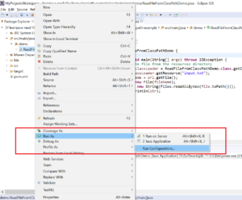
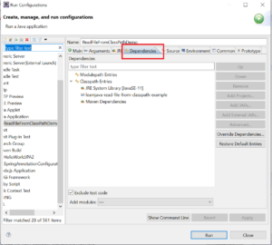
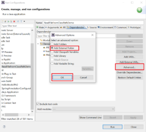
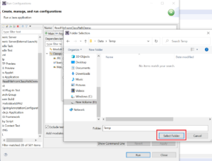
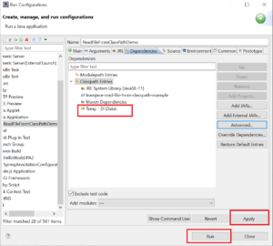
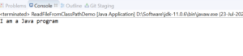

There are often programming situations when you need to read a file on the [classpath](https://learnjava.co.in/java-path-and-classpath-explained/) via Java. In this article, I will show you how to write code for this.

## Reading a file on the classpath

Let us first take a look at the code that you need to write to read a file on the classpath.

```
public class ReadFileFromClassPathDemo {

  public static void main(String[] args) throws IOException {
    // read in the file from the resources directory
    ClassLoader classLoader = ReadFileFromClassPathDemo.class.getClassLoader();
    URL url = classLoader.getResource("input.txt");
    String fileName = url.getFile();
    File file = new File(fileName);
    String str = new String(Files.readAllBytes(file.toPath()));
    System.out.println(str);
  }

}
```

Java has an in-built class called `ClassLoader`. It is used to dynamically load classes. It can also be used to load resources from the classpath. The code above first obtains a `ClassLoader`. It then invokes the `getResource` method on the `classLoader`. This loads the resource (in this case a file named **input.txt**) from the file system and returns an `URL` instance. The `URL` class has a `getFile` method that returns the fully qualified filename. A `File` object is then created using the filename. Finally, the `Files.readAllBytes` method is used to then read the contents of the file into a String.

## Running code in Eclipse

In case you need to test the code above from an IDE like Eclipse, you need to do the following:

Step 1 - Right-click on the class name and click **Run As > Run Configurations**:

[](images/1-run-as.png)

Step 2 - Click on the **Dependencies** Tab:

[](images/2-dependencies.png)

Step 3 - Click on **Classpath entries**. Click on **Advanced > Add External Folder**:

[](images/3-advanced.png)

Step 4 - Navigate to the file system and select the folder which contains the file to be read (**D:/Data/Temp** in my case):

[](images/4-filesection.png)

Step 5 - Verify that the folder is added to the classpath. Click on **Apply** and **Run**:

[](images/5-apply.png)

Step 6 - Verify that the file is read and its contents are displayed on the console:

[](images/6-output-1.png)

## Maven project

In the case of a Maven project, anything placed within the src/main/resources folder of the Maven project is automatically available on the classpath. So, if you place your input file in the src/main/resources folder, the code above will be able to read it.

## Further Reading

- [Java Programming Masterclass](https://click.linksynergy.com/deeplink?id=MnzIZAZNE5Y&mid=39197&murl=https%3A%2F%2Fwww.udemy.com%2Fcourse%2Fjava-the-complete-java-developer-course%2F)
- [Core Java Made Easy](https://click.linksynergy.com/deeplink?id=MnzIZAZNE5Y&mid=39197&murl=https%3A%2F%2Fwww.udemy.com%2Fcourse%2Fcorejavamadeeasy%2F)

## Conclusion

So, in this article, we saw how to read a file on the classpath via Java. We also saw how to run the code in Eclipse.
