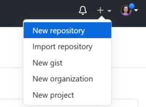
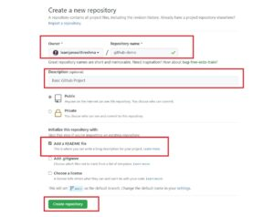
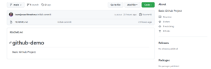
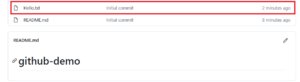

* * *

In this article, I will be listing down a few basic instructions to create a [remote](https://learnjava.co.in/some-git-terminologies/) repository in git. Creating a remote Git repository is a two-step process. First, you need to create a remote repository on your Git hosting system (Github) and then you can push your local changes to it. Let us now take a look at these steps.

## Creating a repository on Github

Step 1: Go to Github.com. Sign in/Sign up

Step 2: Click on the "+" sign in the top right and click New Repository:

[](https://learnjava.co.in/wp-content/uploads/2021/12/Github-New-Repository.png)

Step 3: In the new repository page, enter the name (`github-demo`). Click on the checkbox to "**Add a Readme**" file. Add a description if required. Click on **"Create Repository"**:

[](https://learnjava.co.in/wp-content/uploads/2021/12/Github-New-Repository.jpeg)

This creates a repository as follows:

[](https://learnjava.co.in/wp-content/uploads/2021/12/Github-repository-created-1.png)

 

## Create a Local Repository

The next step is to create a local git repository. For this, you need to follow the steps given below.

Step 4: Open a command prompt/terminal window/git bash prompt

Step 5: Clone the newly created repository by running the following command (Replace <githubusername> with your own username):

`git clone https://github.com/<githubusername>/github-demo.git`

This command creates the `github-demo` directory on your local system.

Step 6: Add the necessary files to this directory. For the sake of simplicity, I will be adding just one file called `Hello.txt`  to the `github-demo` directory. However, you can add all your source code files.

Step 4: Add the newly added files to the local repository. Since I have just the _Hello.txt_, I will use the following command (after navigating to the `github-demo` directory):

```
git add Hello.txt
```

Step 7: Commit files to your local repository:

```
git commit -m "Initial commit"
```

Step 8: Push the changes to the remote repository:

```
git push origin main
```

In your browser window, refresh the page and verify that the newly added "Hello.txt" is shown on Github:

[](https://learnjava.co.in/wp-content/uploads/2021/12/git_repository_added_file.png)

You can similarly add your code changes to this repository as required.

## Further Learning

- [The Git & Github Bootcamp](https://click.linksynergy.com/deeplink?id=MnzIZAZNE5Y&mid=39197&murl=https%3A%2F%2Fwww.udemy.com%2Fcourse%2Fgit-and-github-bootcamp%2F)
- [The Complete Git Guide](https://click.linksynergy.com/deeplink?id=MnzIZAZNE5Y&mid=39197&murl=https%3A%2F%2Fwww.udemy.com%2Fcourse%2Fgit-and-github-complete-guide%2F)

## Conclusion

So, in this article, we saw how to create a remote Github repository.
