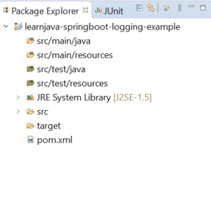
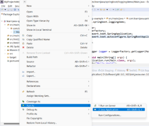

In this article, we will learn how to use logging in SpringBoot.

## Introduction

There are several Java logging frameworks like logback, log4j, and so on. Spring Boot supports out-of-the-box support for logback. Let us learn how to use logging in SpringBoot with logback.

## Step 1 - Create a New Maven Project

Create a new Maven project. (Refer [this](https://learnjava.co.in/how-to-create-a-maven-project-in-eclipse/)blog post). This will create a project in Eclipse as follows:



Step 2 - Add the Spring Boot Dependencies

Add the `spring-boot-starter-web` dependency to the `pom.xml`. So, the `pom.xml` should look as follows:

```
<project xmlns="http://maven.apache.org/POM/4.0.0" xmlns:xsi="http://www.w3.org/2001/XMLSchema-instance" xsi:schemaLocation="http://maven.apache.org/POM/4.0.0 https://maven.apache.org/xsd/maven-4.0.0.xsd">
  <modelVersion>4.0.0</modelVersion>
  <groupId>com.learnjava</groupId>
  <artifactId>learnjava-springboot-logging-example</artifactId>
  <version>0.0.1-SNAPSHOT</version>
  <parent>
    <groupId>org.springframework.boot</groupId>
    <artifactId>spring-boot-starter-parent</artifactId>
    <version>2.1.2.RELEASE</version>
  </parent>
  <dependencies>
    <dependency>
      <groupId>org.springframework.boot</groupId>
      <artifactId>spring-boot-starter-web</artifactId>
    </dependency>
  </dependencies>  
</project>
```

## Step 3 - Write Code

Create a `Main.java` class as follows:

```
import org.slf4j.Logger;
import org.slf4j.LoggerFactory;
import org.springframework.boot.SpringApplication;
import org.springframework.boot.autoconfigure.SpringBootApplication;

@SpringBootApplication
public class Main {
  
  private static Logger logger = LoggerFactory.getLogger(Main.class);

    public static void main(String[] args) {
          SpringApplication.run(Main.class, args);
          logger.info("Hello World");
      }

}
```

## Step 4 - Run the Application

Run `Main.java` as a Java application as follows:.

[](images/Run-main-300x254.png)

This prints the log statement on the console:

```
  .   ____          _            __ _ _
 /\\ / ___'_ __ _ _(_)_ __  __ _ \ \ \ \
( ( )\___ | '_ | '_| | '_ \/ _` | \ \ \ \
 \\/  ___)| |_)| | | | | || (_| |  ) ) ) )
  '  |____| .__|_| |_|_| |_\__, | / / / /
 =========|_|==============|___/=/_/_/_/
 :: Spring Boot ::        (v2.1.2.RELEASE)

2022-11-12 22:05:10.994  INFO 19352 --- [           main] o.a.c.c.C.[Tomcat].[localhost].[/]       : Initializing Spring embedded WebApplicationContext
2022-11-12 22:05:10.994  INFO 19352 --- [           main] o.s.web.context.ContextLoader            : Root WebApplicationContext: initialization completed in 1235 ms
2022-11-12 22:05:11.233  INFO 19352 --- [           main] o.s.s.concurrent.ThreadPoolTaskExecutor  : Initializing ExecutorService 'applicationTaskExecutor'
2022-11-12 22:05:11.459  INFO 19352 --- [           main] o.s.b.w.embedded.tomcat.TomcatWebServer  : Tomcat started on port(s): 8080 (http) with context path ''
2022-11-12 22:05:11.461  INFO 19352 --- [           main] c.learnjava.springboot.loggingdemo.Main  : Started Main in 1.995 seconds (JVM running for 2.293)
2022-11-12 22:05:11.462  INFO 19352 --- [           main] c.learnjava.springboot.loggingdemo.Main  : Hello World
```

## Step 5 - Customize logback

Spring Boot allows specifying a logback configuration file that can help with customizing the logs. The logback configuration file is an XML file.

Create the following file in your **src/main/resources** directory:

```
<?xml version="1.0" encoding="UTF-8"?>
<configuration>
     <property name="LOGS_DIR" value="D:/Data/logs" />
    <appender name="MAIN"
        class="ch.qos.logback.core.rolling.RollingFileAppender">
        <file>${LOGS_DIR}/mylog.log</file>
        <encoder
            class="ch.qos.logback.classic.encoder.PatternLayoutEncoder">
            <Pattern>%d %p %C{1.} [%t] %m%n</Pattern>
        </encoder>

        <rollingPolicy
            class="ch.qos.logback.core.rolling.TimeBasedRollingPolicy">
            <!-- rollover daily and when the file reaches 10 MegaBytes -->
            <fileNamePattern>${LOGS_DIR}/mylog-%d{yyyy-MM-dd}.%i.out.gz
            </fileNamePattern>
            <timeBasedFileNamingAndTriggeringPolicy
                class="ch.qos.logback.core.rolling.SizeAndTimeBasedFNATP">
                <maxFileSize>10MB</maxFileSize>
            </timeBasedFileNamingAndTriggeringPolicy>
        </rollingPolicy>
    </appender>
    
    <!-- LOG everything at INFO level -->
    <root level="info">
        <appender-ref ref="MAIN" />
    </root>
</configuration>
```

The above configures logback to write the logs to an external log file instead of to the console. So, when you rerun the application, the logs would be written to the **D:/Data/logs/mylogs.log** file as configured in this file.

## Source Code

The complete source code for this application can be found on [Github](https://github.com/learnjavawithreshma/learnjava-springboot-logging-example).

## Further Reading

- [Learn Spring and Spring Boot](https://click.linksynergy.com/deeplink?id=MnzIZAZNE5Y&mid=39197&murl=https%3A%2F%2Fwww.udemy.com%2Fcourse%2Fspring-springboot-jpa-hibernate-zero-to-master%2F)
- [Learn Spring Boot in Easy Steps](https://click.linksynergy.com/deeplink?id=MnzIZAZNE5Y&mid=39197&murl=https%3A%2F%2Fwww.udemy.com%2Fcourse%2Fspring-boot-tutorial-for-beginners%2F)
- [Build Rest APIs with Spring Boot](https://click.linksynergy.com/deeplink?id=MnzIZAZNE5Y&mid=39197&murl=https%3A%2F%2Fwww.udemy.com%2Fcourse%2Fbuilding-real-time-rest-apis-with-spring-boot%2F)

## Conclusion

So this article explains how logging works out of the box in SpringBoot with logback.
