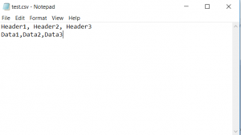
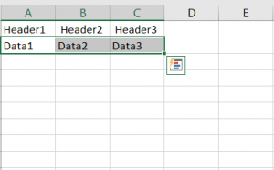

In this blog post, I will be covering how you can read a CSV file via Java.

#### What is a CSV file?

CSV stands for Comma Separated Values. The fields in a CSV file are separated by commas. So for example, a CSV file will be seen in Notepad as follows:



However, if you open the same CSV file in Excel and will be seen as follows:



A CSV file is used to store tabular data. You can open a CSV file in Microsoft Excel.

#### Code to read CSV file

Consider the following code sample:

````java

package learnjava.io;

import java.io.BufferedReader; import java.io.File; import java.io.FileNotFoundException; import java.io.FileReader; import java.io.IOException;

public class ReadCSVDemo {

public static void main(String[] args) { 
    String fileName="F:/Test.csv"; 
    try { 
        BufferedReader br = new BufferedReader(new FileReader(fileName)); 
        String str = br.readLine(); 
        while(str != null) { 
            String[] contents = str.split(","); 
            for(String cell:contents) { 
                System.out.print(cell); 
            } 
            str = br.readLine(); 
            System.out.println(); 
        }

        } catch (FileNotFoundException e) { 
            e.printStackTrace(); 
        } catch (IOException e) {  
            e.printStackTrace(); 
        }
    }
}

````
First, the input file is read line by line using a [BufferedReader](https://docs.oracle.com/javase/8/docs/api/java/io/BufferedReader.html). Each line is [split](https://docs.oracle.com/javase/8/docs/api/java/lang/String.html#split-java.lang.String-) using the String,split method and its contents are printed.
