One of the new features added by Java 9 is the module system. This article is the last part in a 3 part article. In[Part 1](https://learnjava.co.in/java-9-modules-introduction/), I gave a high level introduction to modules and the advantages that they provide. In [Part 2](https://learnjava.co.in/java-9-module-internals/), I covered the details of what exactly a module is, what it consists of and other module internals. In this part, I will be explaining how to create and use a module in Eclipse.

See also [Module Introduction](https://learnjava.co.in/java-9-modules-introduction/) and [Module Internals](https://learnjava.co.in/java-9-module-internals/)

## Creating a Module

As covered in my [earlier](https://learnjava.co.in/java-9-module-internals/) article, a module is a group of packages that helps to organize code better. Let us first create a Java project that has a module.

**Step 1** - Ensure that Java 9 is installed and configured in Eclipse.

**Step 2** - Create a new Java project. Enter a project name. Ensure that JDK 9 is selected.

[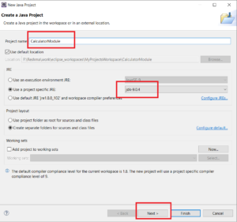](https://learnjava.co.in/wp-content/uploads/2020/03/1.png)

**Step 3** - Click Next. The following screen is shown:

[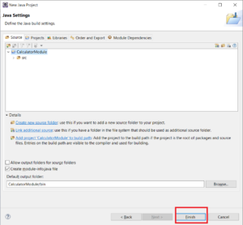](https://learnjava.co.in/wp-content/uploads/2020/03/2.png)

**Step 4**: Click "Finish". A screen for entering module name is shown as below:

[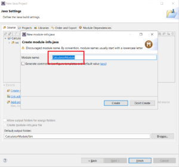](https://learnjava.co.in/wp-content/uploads/2020/03/3.png)

**Step 5** - Enter the module name as "**com.learnjava.calculatormodule**"

[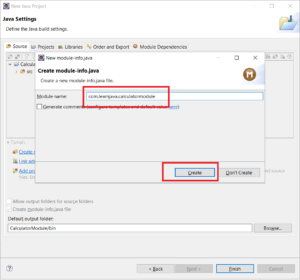](https://learnjava.co.in/wp-content/uploads/2020/03/4.png)

**Step 6** - Click "Create". The Java project is created successfully with the project structure as shown below. The **module-info.java** file is created. As covered in my [earlier](https://learnjava.co.in/java-9-module-internals/) article, the "module-info.java" file contains information about the packages required by the module, exported by the module, etc.

[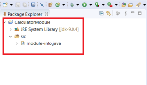](https://learnjava.co.in/wp-content/uploads/2020/03/5-1.png)

**Step 7** - Create new package "**com.learnjava.calculator**" in the project:

[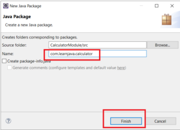](https://learnjava.co.in/wp-content/uploads/2020/03/6.png)

**Step 8** - Create a class called Calculator in the package:

[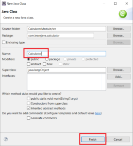](https://learnjava.co.in/wp-content/uploads/2020/03/7.png)

**Step 9**: Add the following code in the Calculator class:

```
public class Calculator {
  
  public int add(int a,int b) {
    return a+b;
  }

}

```

**Step 10** - Specify the package to be exported in the module-info file:

[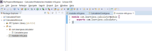](../2020/03/images/8.png) So now, we have created a Java project with a module "**com.learnjava.calculatormodule"**. This module exports the **com.learnjava.calculator** that has the Calculator.java class.

## Creating a Module Client

A module client is a separate module that uses code from another module. So let us write some code that uses the Calculator class.

**Step 1** - Follow steps 1-5 above and create a new project "**CalculatorClient"** with a module "**com.learnjava.calculatorclient**" as follows:

[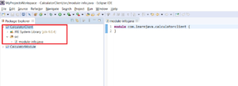](../2020/03/images/c1.png)

**Step 2** - Create a new package "**com.learnjava.client**" and a class "**CalculatorClient**" within that package:

[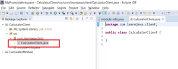](../2020/03/images/c2.png)

**Step 3** - Specify the required package in the module-info file:

[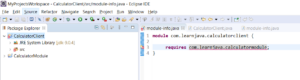](../2020/03/images/c3-1.png)

So this means that the **com.learnjava.calculatorclient** module requires the **com.learnjava.calculatormodule.** If this requires attribute is not specified here, the **com.learnjava.calculatorclient** module will not be able to access the **com.learnjava.calculatormodule.**

The above step will cause a compilation error since the **com.learnjava.calculatormodule**is not present on the build path**.** So we need to fix the project setup as follows:

**Step 4a**: Right click on the project --> properties:

[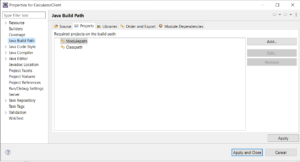](../2020/03/images/c4.png)

**Step 4b**: Click on "Add".

[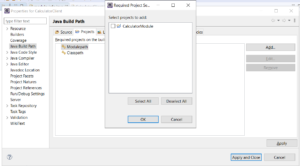](../2020/03/images/c5.png)

**Step 4c**: Select CalculatorModule. Click OK

[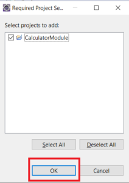](images/c6.png)

**Step 4d:** This adds the calculator module to the path. Click on "Apply And Close":

[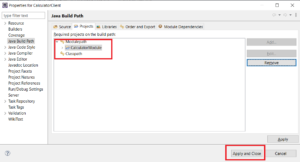](../2020/03/images/c7.png)

Now the compilation error will go away.

**Step 5:** Add the following code to the CalculatorClient class:

```
package com.learnjava.client;

import com.learnjava.calculator.Calculator;

public class CalculatorClient {
  
  public static void main(String args[]) {
    Calculator calculator = new Calculator();
    int result = calculator.add(5, 10);
    System.out.println("Result is:"+result);
  }

}

```

So this code invokes the **Calculator.add** method from the **com.learnjava.calculatormodule**

**Step 6:** Run the CalculatorClient class. This will print the following output:

```
17

```

## Conclusion

So in this article, we saw how to create and use a Java 9 module in Eclipse. This article is the final article in the Java 9 series.
