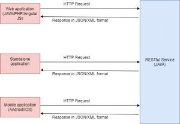

In this blog post, I will be explaining what a REST API is.

# What is REST

REST stands for Representational State Transfer. It is a design pattern for web services. Web services that follow this design pattern are known as RESTful web services. There are 2 main components in a REST API.

## Client

The person or application that uses the services is the client. The client can be a web application, mobile application or even an individual developer.

## Server

The server provides some functionality. The client application makes an HTTP call to the server. Any HTTP method (i.e. GET, POST, PUT, DELETE) can be used. The server then acts on the request by the client. So if the client sends an HTTP GET request, the server returns the requested information. If the client sends an HTTP POST request, the server performs the necessary operation with the data sent by the client.

# How REST works

The server exposes functionality as REST endpoints which are simply URLs. The client application needs to access the URL for the functionality that it wishes to invoke and specify the HTTP method.

For example, suppose we have a stock price application that returns the current price of a particular stock. Suppose, this application is implemented as a REST service. The server might expose a URL like stockapp/getQuote. The client needs to access this URL and specify the HTTP GET request. When the server receives the URL request, it returns the price of the stock specified.

# What is special about a RESTful service

The main thing that makes a RESTFul service different is it just returns the data. The data can be in XML or JSON format. It is up to the client to use the data in whatever way they wish. So if it's a web application, it may simply put the data returned by the REST service in an HTML format and display it to a user. However, if a standalone application or as middle-tier application, it may simply use the data returned by the REST service for some other computations.

A RESTFul service is also independent of technology. So a REST service can be implemented in Java/Node.js/PHP or some other technology. So also, the REST client can be implemented in any technology. It can be a web application implemented via JSP/Servlets or Angular JS or it can be a mobile application implemented via Andriod or iOS.

# REST Architecture

The following diagram explains the REST architecture:

# How to implement a RESTful service in Java

There are a couple of ways that you can implement s RESTFul service in Java

## Using JAX-RS and Jersey

Java provides the Java API for RESTful Web Services (JAX-RS). This is part of the JDK since Java 6 and so does not need to be included separately. Jersey is the reference implementation of JAX-RS specification. There are other implementations like RESTEasy as well.

So if you want to create a RESTful service, you need to create a web application in Java. Depending on the Server that you are using, you may or may not need to include a JAX-RS implementation. Some servers like GlassFish are shipped with Jersey so it does not need to be included explicitly. JBoss is shipped with RESTEasy so again if you are using JBoss, you do not need to include any JAX-RS implementation. If you are using Tomcat, it does not come with any implementation, so you need to include the JAR file for Jersey or whichever JAX-RS implementation that you plan to use.

You then need to write the code for your RESTful service endpoint. Finally, you need to deploy your application as in your server. The client can then access the URL of the RESTful service.

Refer to [this](how-to-create-a-rest-service-in-java-using-jax-rs-and-eclipse.md) post to see an example of how to create a REST service using JAX-RS and Jersey

## Spring

Spring Framework also provides REST capabilities. It is not a JAX-RS implementation, but it is a Spring alternative to JAX-RS. The annotations provided by JAX-RS and Spring are also slightly different. Again, you need to create a Web application using Spring and write the code for your REST service.

Refer to [this](../spring-and-spring-boot/how-to-create-springboot-rest-service-and-test-it-via-postman.md) post to see an example of how to create a SpringBoot REST service and test it via Postman.

Refer to [this](../spring-and-spring-boot/how-to-create-a-spring-rest-application-via-maven-and-eclipse.md) post to see an example of how to create a Spring REST service and test it via Postman.
