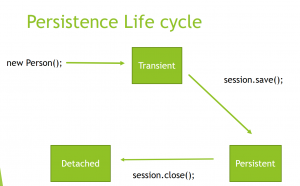

In this blog post, I will be explaining the Hibernate Persistence Life Cycle and Entity States.

# What Are Entity States

Given an object that is mapped via Hibernate, it can be in any one of 3 different states – transient, persistent and detached.

**Transient**

A transient object is an object that is not associated with a session and that does not have a database record. When you create a new object of a POJO class, that entity instance is in the transient state. _Transient_ objects exist only in memory, Hibernate does not manage transient objects.

**Persistent**

A persistent object is an object that has a database record and that is associated with an active session. So the moment you invoke session.save on a transient object, it moves to the persistent state. Once an object is in the persistent state, hibernate tracks changes to it and automatically saves these changes to the database when the session is flushed.

**Detached**

An object that has a database record but is not associated with a session is a detached object. When a session is closed, all entities associated with the session become detached. Although _Detached_ objects have a database record, changes to the object will not be reflected in the database, and vice versa.

# Persistence Life Cycle

The following diagram demonstrates the Persistence Life Cycle:

So as you can see, when you create a new object, it is in the transient state. Invoking session.save() moves the object to the persistent state. When you close the session via the session.close, the object is moved to the detached state.

This is a simplified diagram of the persistence life cycle. In reality, there are several other methods too, that can change an entity from one state to the other.
