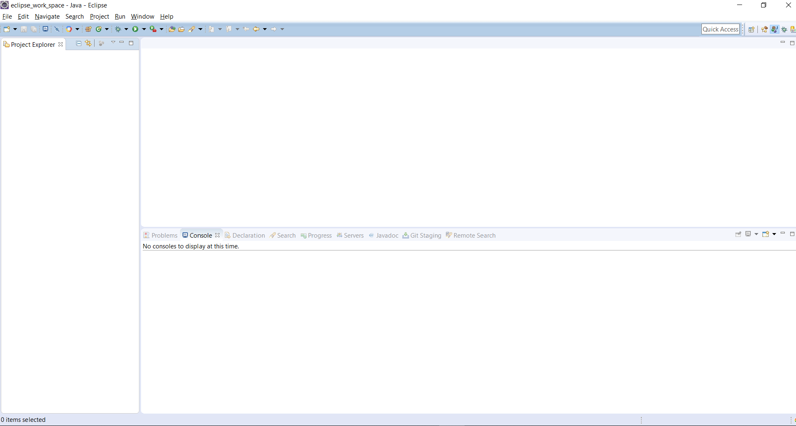
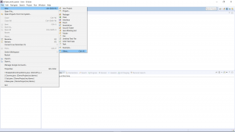
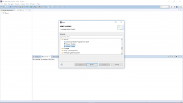
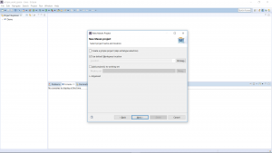
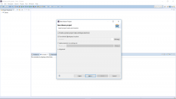
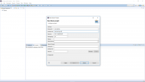
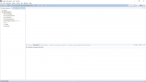

In this blog post, I will be explaining how to create a Maven project in Eclipse:

1. **Step 1 - Open Eclipse**

[

**2\. Click on File --> New --> Other**

**3\. Click on Maven Project under Maven:**

**4\. Click Next:**

**5\. Click on Create a simple project (Skip archtype selection). Click on Next:**

**6\. Enter group Id and artifact Id in the screen:**

**7. Click Finish. Your Maven project is ready. You can start adding dependencies in your pom file and start writing Java code in src/main/java folder:**

**Further Reading**

- [Apache Maven Beginner to Guru](https://click.linksynergy.com/deeplink?id=MnzIZAZNE5Y&mid=39197&murl=https%3A%2F%2Fwww.udemy.com%2Fcourse%2Fapache-maven-beginner-to-guru%2F)
- [Maven Crash Course](https://click.linksynergy.com/deeplink?id=MnzIZAZNE5Y&mid=39197&murl=https%3A%2F%2Fwww.udemy.com%2Fcourse%2Fmavencrashcourse%2F)
- [Java Programming in Eclipse](https://click.linksynergy.com/deeplink?id=MnzIZAZNE5Y&mid=39197&murl=https%3A%2F%2Fwww.udemy.com%2Fcourse%2Feclipse-the-basic-java-programming-course%2F)
