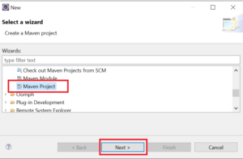
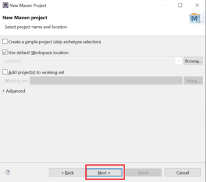
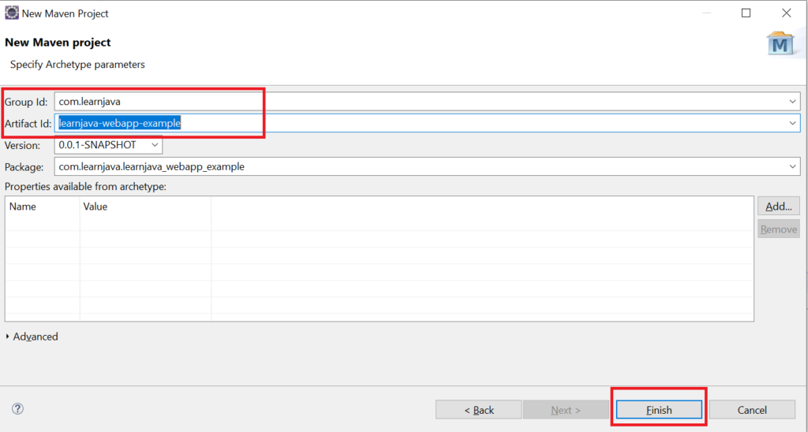
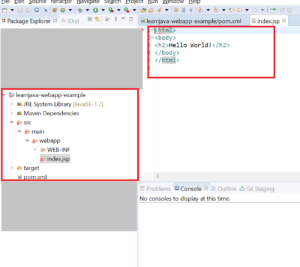

In my [earlier](how-to-create-a-maven-web-project-in-eclipse.md) article, we learned how to create a Java web project in Eclipse and how to add Maven support to it. In this article, we will learn how to create a Maven web project using archetype selection.

## Create Maven Web Project In Eclipse

Step 1 - In Eclipse, Click on **File** > **New** > **Other**. Click on **Maven Project**. Click **Next**:

Step 2 - The following screen is displayed. Click **Next**:

Step 3 - In the Filter text box, type "**maven-archetype-webapp**". Select "**org.apache.maven.archetypes**". Click **Next**:

Step 4 - Enter **Group Id** and **Artifact Id**. Click **Finish**:

This creates a web project with the required directory structure:

Now you can add the necessary dependencies to your pom file as explained in [this](how-to-add-maven-dependencies-via-eclipse.md) post. So for example, if you are creating a Spring application, you can add Spring dependencies. You can also use this as a template to create any web application with Maven support.

## Further Learning

- [Apache Maven Beginner to Guru](https://click.linksynergy.com/deeplink?id=MnzIZAZNE5Y&mid=39197&murl=https%3A%2F%2Fwww.udemy.com%2Fcourse%2Fapache-maven-beginner-to-guru%2F)
- [Maven Crash Course](https://click.linksynergy.com/deeplink?id=MnzIZAZNE5Y&mid=39197&murl=https%3A%2F%2Fwww.udemy.com%2Fcourse%2Fmavencrashcourse%2F)
- [Java Programming in Eclipse](https://click.linksynergy.com/deeplink?id=MnzIZAZNE5Y&mid=39197&murl=https%3A%2F%2Fwww.udemy.com%2Fcourse%2Feclipse-the-basic-java-programming-course%2F)

## Conclusion

So, in this article, we understood how to create a Maven web project in Eclipse using archetype selection.
