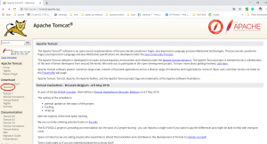
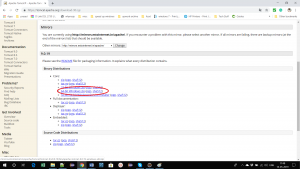
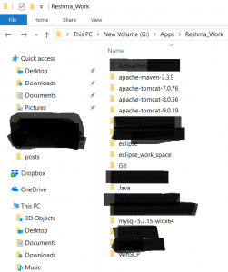
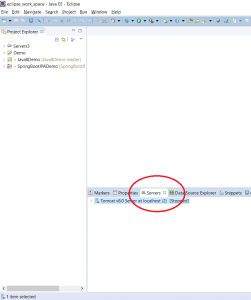
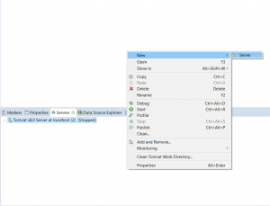
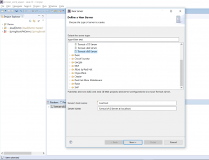
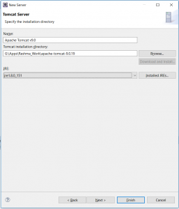
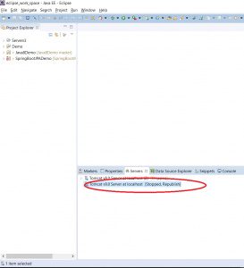

In this blog post, I will demonstrate how to set up Tomcat in Eclipse.

**Step 1 - Visit Tomcat Site and select Tomcat 9**

Go to the Tomcat site - http://tomcat.apache.org/. Click on Tomcat 9 in the left pane as shown below:

**Step 2 - Download the appropriate version**

I will be downloading the 64-bit windows version

**Step 3 - Extract the contents of the zip file to an appropriate folder**

The zip file will contain a folder with the name as "apache-tomcat-9.0.19". Copy this to an appropriate folder

**Step 4 - Open Eclipse. Go to servers tab**

**Step 7 - Right click --> New --> Server**

**Step 8 - Select Tomcat 9.0 Server**

**Step 9 - Click Next. Select Tomcat installation directory and JRE 1.8.**

**Step 10 - Click Finish**

**Further Reading**

- [Fundamentals of Apache Tomcat](https://click.linksynergy.com/deeplink?id=MnzIZAZNE5Y&mid=39197&murl=https%3A%2F%2Fwww.udemy.com%2Fcourse%2Ffundamentals-of-apache-tomcat%2F)
- [Beginning with Eclipse IDE](https://click.linksynergy.com/deeplink?id=MnzIZAZNE5Y&mid=39197&murl=https%3A%2F%2Fwww.udemy.com%2Fcourse%2Fbeginners-eclipse-java-ide-training-course%2F)
- [Apache Tomcat Beginners to Advanced](https://click.linksynergy.com/deeplink?id=MnzIZAZNE5Y&mid=39197&murl=https%3A%2F%2Fwww.udemy.com%2Fcourse%2Fapache-tomcat-for-beginners-and-advanced%2F)
- [Java Programming in Eclipse](https://click.linksynergy.com/deeplink?id=MnzIZAZNE5Y&mid=39197&murl=https%3A%2F%2Fwww.udemy.com%2Fcourse%2Feclipse-the-basic-java-programming-course%2F)
