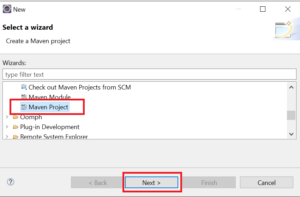
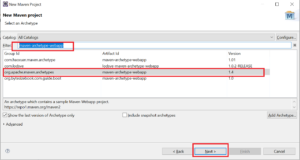
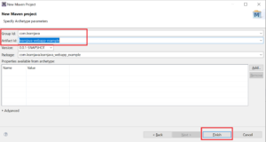
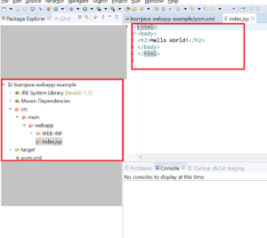

The Tomcat Maven plugin helps to run a Java web application in an embedded Tomcat container. Thus, this allows developers to quickly develop and build a web application without having to install Tomcat. In this article, we will be learning how to use this plugin.

## Creating a Maven Project

Let us first create a simple Maven web project. I will be using Eclipse IDE.

In order to create a Maven web project in Eclipse, you need to follow the steps given below:

Step 1 - Click on **File > New > Other**. Click on **Maven Project**. Click **Next**:

[](images/2.png)

Step 2 - The following screen is displayed. Click **Next**:

[](images/3.png)

Step 3 - In the Filter text box, type **"maven-archetype-webapp"**.  Select "**org.apache.maven.archetypes**". Click **Next**:

[](images/5.png)

Step 4 - Enter **Group Id** and **Artifact Id**. Click **Finish**:

[](images/6.png)

This creates a web project with the required directory structure. It also has a basic hello world page:

[](images/tomcat-maven-plugin/7-1.png)

## Adding the Tomcat plugin

In order to support the Tomcat Maven plugin, we need to add it to the pom.xml file.

```
	<plugins>
        <groupId>org.apache.tomcat.maven</groupId>
       <artifactId>tomcat7-maven-plugin</artifactId>
       <version>2.2</version>
       <configuration>
         <port>9090</port>
         <path>/</path>
         <contextReloadable>true</contextReloadable>
       </configuration>
     </plugin>
   </plugins>
```

## Testing the code

That is all that is required. Now, you can easily deploy and test your code in the embedded Tomcat container. There is no need to install Tomcat separately.

In order to test the code, you need to follow the steps given below:

Step 1 - Open a command prompt. Navigate to the project directory (in this case the `learnjava-webapp-example`).

Step 2 - Build the code using the following Maven command:

```
mvn clean install
```

Step 3 - Run the following command to start the embedded Tomcat container:

```
mvn tomcat7:run
```

Step 4 - Open a browser and type http://localhost:8080

This should display a hello world page.

The complete source code for this example is available on my [Github](https://github.com/reshmabidikar/learnjava-webapp-example) page.

## Conclusion

So, in this article we created a simple Maven web project using the webapp archetype. We then added support for the Tomcat plugin to the pom file. Finally, we saw how to start the embedded Tomcat container and test the application.
