In this article, I will be demonstrating how you can create a basic Python program using eclipse in Pydev. If you want to see how to setup Pydev with Eclipse, refer to [this](how-to-setup-pydev-with-eclipse.md) article.

# Creating a Python Project

Step 1 - Click on File --> New --> Pydev project

[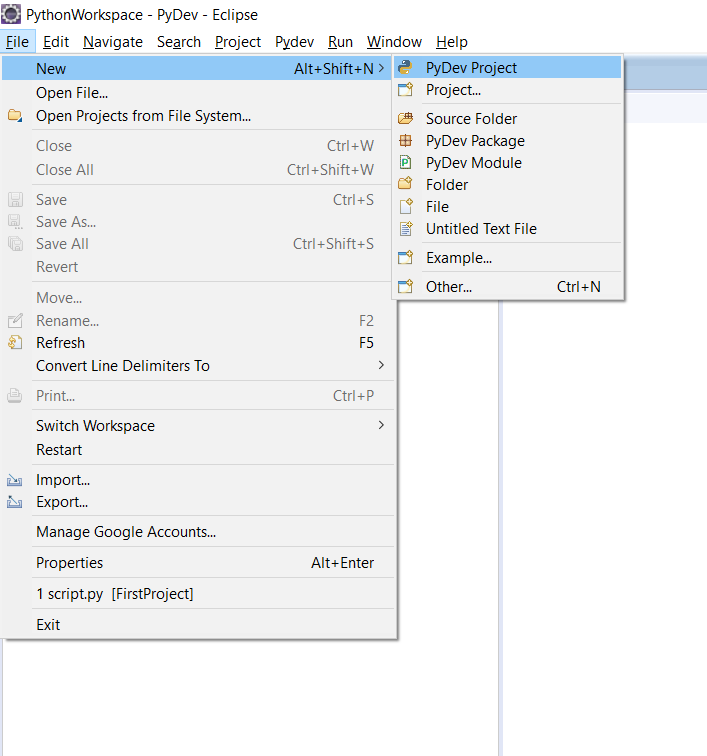](images/create-python-program-in-eclipse/CreatePythonProjectInEclipse.png)

The following screen is shown:

[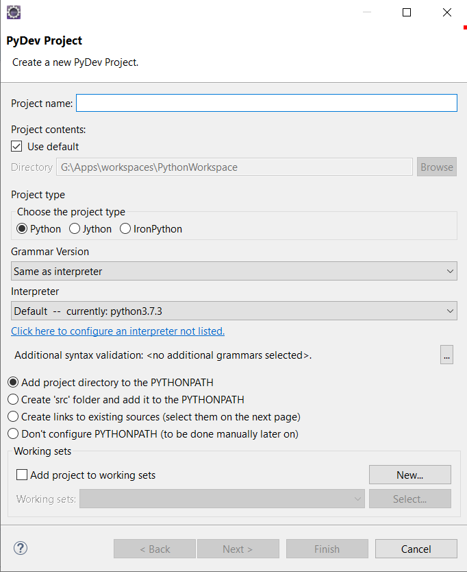](images/create-python-program-in-eclipse/CreatePythonProjectInEclipse2.png)

Step 2 - Enter a project name and click on Next:

[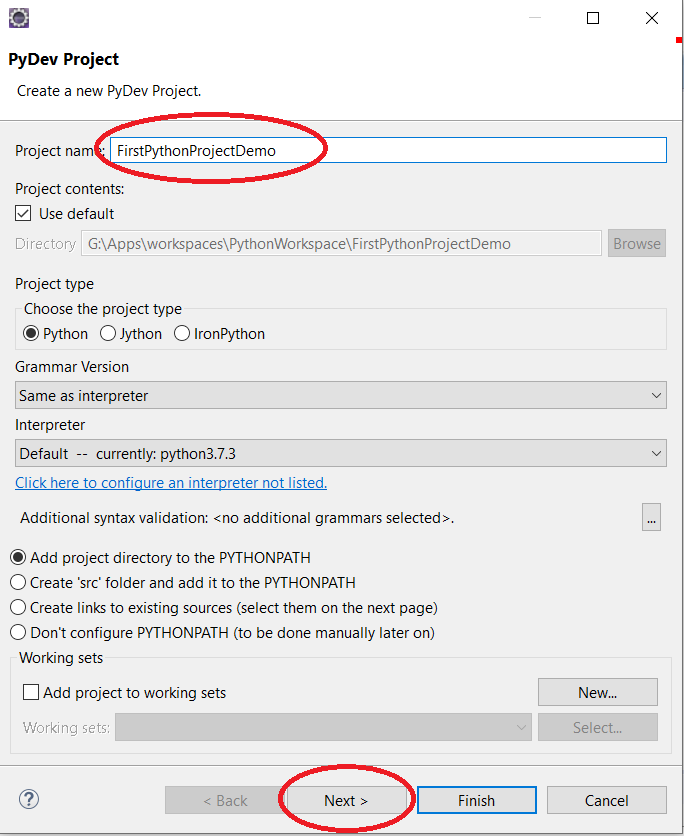](images/create-python-program-in-eclipse/CreatePythonProjectInEclipse3.png)

Step 3 - The following screen is shown. Click on finish:

[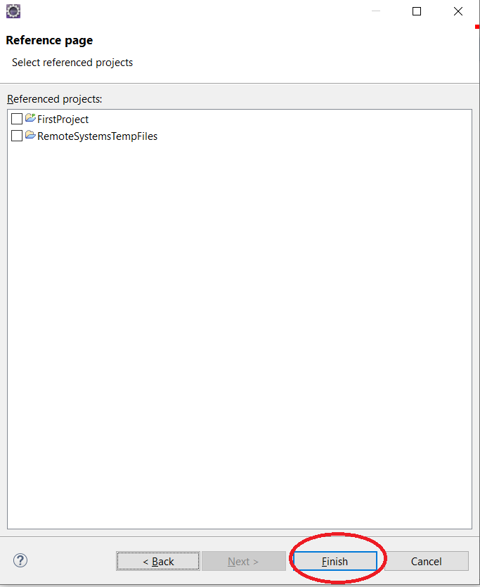](images/create-python-program-in-eclipse/CreatePythonProjectInEclipse4-1.png)

This creates the project as follows:

[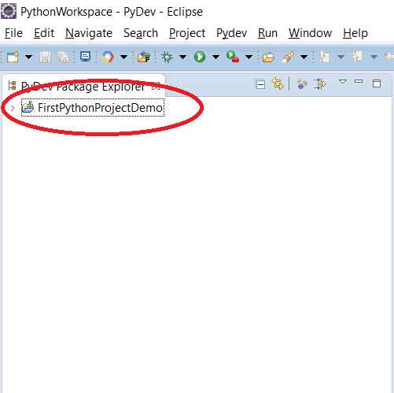](images/create-python-program-in-eclipse/CreatePythonProjectInEclipse5.png)

# Creating a new Python Module

After creating a new Python project, the next step is to create a new Python module.

Step 1 - Right click on the project, click on New --> Pydev module:

[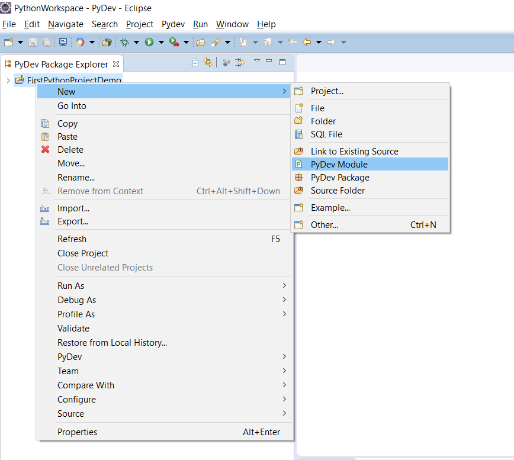](images/create-python-program-in-eclipse/CreatePythonModule.png)

The following screen will be shown:

[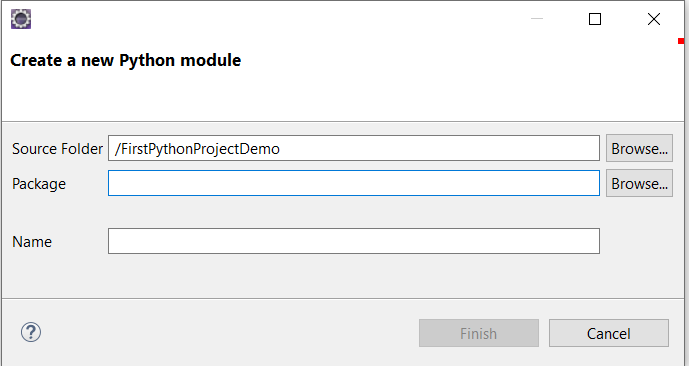](images/create-python-program-in-eclipse/CreatePythonModule2.png)

Step 2 - Enter a name for the module. Leave the package field blank. Click on "Finish":

[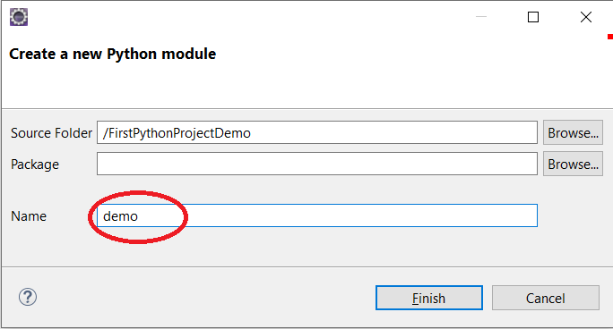](images/create-python-program-in-eclipse/CreatePythonModule3.png)

Step 3 - This displays the following screen. Click on "OK"

[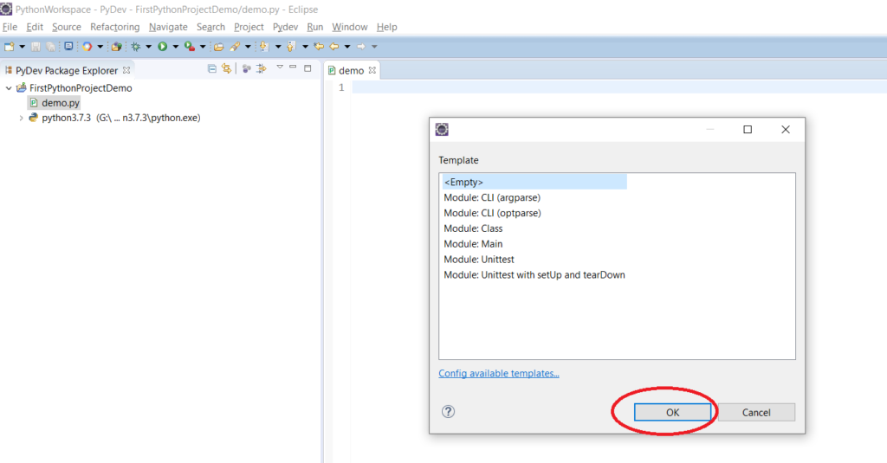](images/create-python-program-in-eclipse/CreatePythonModule4.png)

This shows the python module in the project as follows:

[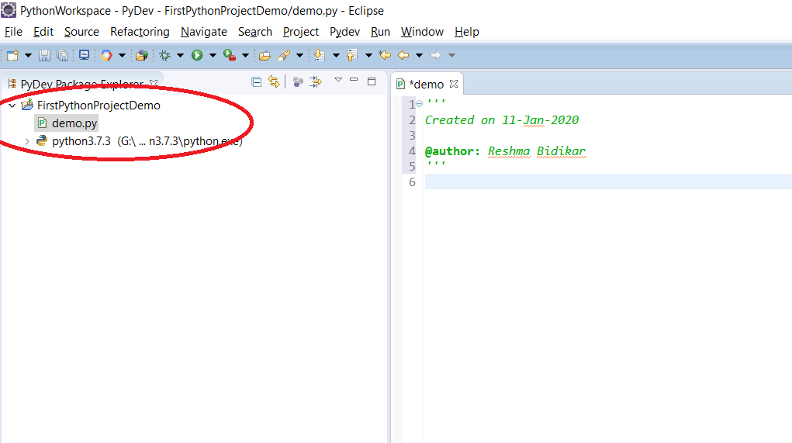](images/create-python-program-in-eclipse/CreatePythonModule5.png)

# Writing some basic Python code

The next step is to write Python code.

Step 1 - Type the code shown below:


[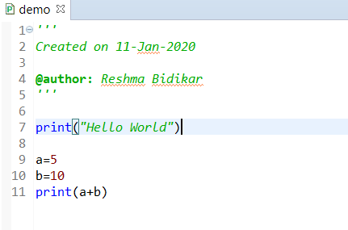](images/create-python-program-in-eclipse/firstpythoncode2.png)

The first statement prints the text "Hello World". The second statement prints the result of adding the values assigned to 'a' and 'b'. So this code prints the following output:

```
Hello World
15
```

## Further Learning

- [The Python Masterclass](https://click.linksynergy.com/deeplink?id=MnzIZAZNE5Y&mid=39197&murl=https%3A%2F%2Fwww.udemy.com%2Fcourse%2Fpython-the-complete-python-developer-course%2F) 
- [Everything you need to know about Python](https://click.linksynergy.com/deeplink?id=MnzIZAZNE5Y&mid=39197&murl=https%3A%2F%2Fwww.udemy.com%2Fcourse%2Fthe-python-bible%2F) 
- [Python for beginners](https://click.linksynergy.com/deeplink?id=MnzIZAZNE5Y&mid=39197&murl=https%3A%2F%2Fwww.udemy.com%2Fcourse%2Fpython-programming-projects%2F) 
- [Python for finance](https://click.linksynergy.com/deeplink?id=MnzIZAZNE5Y&mid=39197&murl=https%3A%2F%2Fwww.udemy.com%2Fcourse%2Fpython-for-finance-investment-fundamentals-data-analytics%2F)
