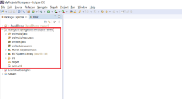
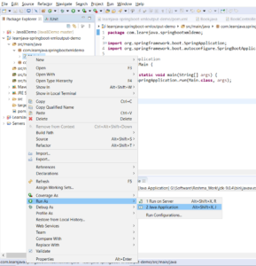
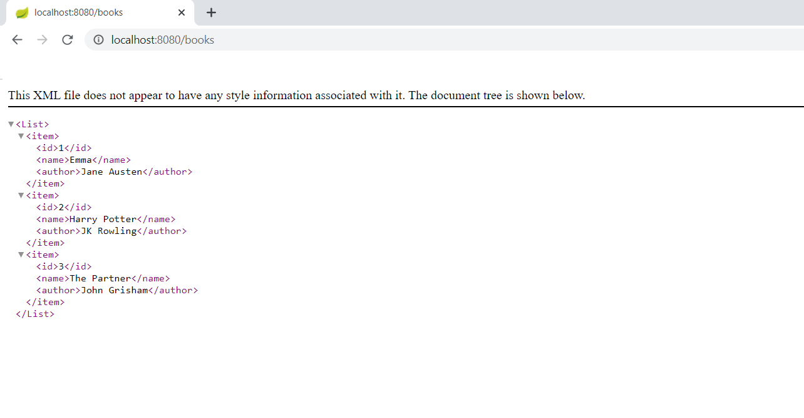

In this article, I will be explaining how to create a Spring Boot REST service that produces an XML output. 

## Project Creation and Setup

**Step 1 – Create a new Maven Project** (Refer to [this](https://reshmabidikar.github.io/2018/10/how-to-create-a-maven-project-in-eclipse.html) blog post). This should create a project as shown below:

[](images/spring-boot-rest-service-xml-output/Maven-project.png)

**Step 2 - Add the Spring Boot and Jackson dependency**. So, your the **pom.xml** file should be similar to the following:

```xml
<project xmlns="http://maven.apache.org/POM/4.0.0"
  xmlns:xsi="http://www.w3.org/2001/XMLSchema-instance"
  xsi:schemaLocation="http://maven.apache.org/POM/4.0.0 https://maven.apache.org/xsd/maven-4.0.0.xsd">
  <modelVersion>4.0.0</modelVersion>
  <groupId>com.learnjava</groupId>
  <artifactId>learnjava-springboot-xmloutput-demo</artifactId>
  <version>0.0.1-SNAPSHOT</version>
  <parent>
    <groupId>org.springframework.boot</groupId>
    <artifactId>spring-boot-starter-parent</artifactId>
    <version>2.1.2.RELEASE</version>
  </parent>
  <dependencies>
    <dependency>
      <groupId>org.springframework.boot</groupId>
      <artifactId>spring-boot-starter-web</artifactId>
    </dependency>
        <dependency>
            <groupId>com.fasterxml.jackson.dataformat</groupId>
            <artifactId>jackson-dataformat-xml</artifactId>
        </dependency>
    </dependencies>
    <properties>
        <java.version>1.8</java.version>
    </properties>
</project>
```

## Writing Code

**Step 3 - Create a Book class** as follows:

```java
package com.learnjava.springbootxmldemo.book;

public class Book {

  private int id;
  private String name;
  private String author;

        //constructor, getters and setters
}
```

This class represents a Book. It has fields corresponding to id, name and author.


**Step 4 - Create a BookController class** as follows:

```java
package com.learnjava.springbootxmldemo.book;

import java.util.ArrayList;
import java.util.List;

import org.springframework.web.bind.annotation.GetMapping;
import org.springframework.web.bind.annotation.RestController;

@RestController
public class BookController {

   @GetMapping(value="/books",produces = { "application/xml", "text/xml" })
    public List<Book> getAllBooks(){
      //Returns hardcoded data, a real world application would return from the database
      List<Book> books = new ArrayList<Book>();
      books.add(new Book(1,"Emma", "Jane Austen"));
      books.add(new Book(2,"Harry Potter", "JK Rowling"));
      books.add(new Book(3,"The Partner", "John Grisham"));
      return books;
    } 
   
   @GetMapping(value="/book", produces = { "application/xml", "text/xml" })
    public Book getBook(){
      //Returns hardcoded data, a real world application would return from the database
      return new Book(1,"Emma", "Jane Austen");
    } 
}

```

This is a Controller class and specifies the methods that handle client requests. . It has the [RestController](important-spring-mvc-annotations.md) annotation specified.

It includes the following methods:

**getAllBooks**

- The [GetMapping](important-spring-mvc-annotations.md) annotation is specified on this method. This specifies that this method maps to the **/book**s URL and that it produces an XML output
- The method simply creates a **List** of type **Book**, adds some **Book** objects to it and returns it. A real-world application will typically query a database and obtain Book objects.

**getBook**

- Like **getAllBooks**, this method has the [GetMapping](important-spring-mvc-annotations.md) annotation
- It returns a single **Book** object

**Step 5 - Create a Main class** as follows:

```java
package com.learnjava.springbootxmldemo;

import org.springframework.boot.SpringApplication;
import org.springframework.boot.autoconfigure.SpringBootApplication;

@SpringBootApplication
public class Main {

    public static void main(String[] args) {
          SpringApplication.run(Main.class, args);
      }

}
```

This is the starting point of our Spring Boot application as explained [here](how-to-create-a-hello-world-spring-boot-web-application-in-eclipse-using-maven.md).

## Running the application

**Step 6 - Run Main.java as a Java application** as shown below:

[](images/spring-boot-rest-service-xml-output/Running-application.png)

Step 7 - Open a browser window. Type **http://localhost:8080/books/** . This displays the following XML output:

[](images/spring-boot-rest-service-xml-output/output.png)

You can download the source code for this project via the Github repository [here](https://github.com/learnjavawithreshma/learnjava-springbootxmloutput-demo).

## Conclusion

So, in this article, we saw how to create a Spring Boot application that produces an XML output.
