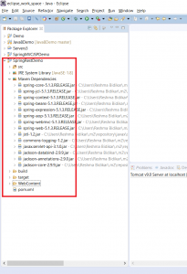
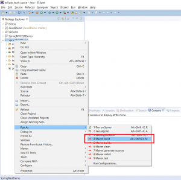
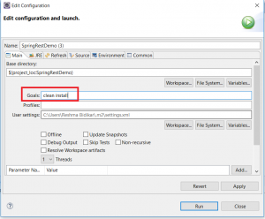
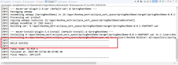
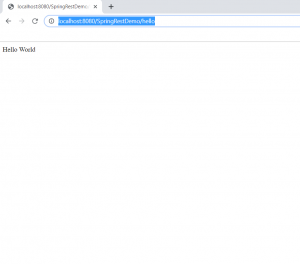
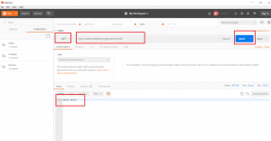

In this article, I will be demonstrating how to create a REST application via Spring using Maven and Eclipse.

## Create a Project and And Maven Support

Step 1 - Follow the steps in [this](https://reshmabidikar.github.io/2018/10/how-to-create-a-maven-project-in-eclipse.html) article to create a web project in Eclipse with Maven Support. You should see a project as follows:

[](images/spring-rest-application-maven-eclipse/project.png)

Step 2 - Add the Maven Dependencies for Spring to the pom file as follows:

```xml
<dependencies>
    <dependency>
      <groupId>org.springframework</groupId>
      <artifactId>spring-core</artifactId>
      <version>5.1.3.RELEASE</version>
    </dependency>
    <dependency>
      <groupId>org.springframework</groupId>
      <artifactId>spring-context</artifactId>
      <version>5.1.3.RELEASE</version>
    </dependency>
    <dependency>
      <groupId>org.springframework</groupId>
      <artifactId>spring-aop</artifactId>
      <version>5.1.3.RELEASE</version>
    </dependency>
    <dependency>
      <groupId>org.springframework</groupId>
      <artifactId>spring-webmvc</artifactId>
      <version>5.1.3.RELEASE</version>
    </dependency>
    <dependency>
      <groupId>org.springframework</groupId>
      <artifactId>spring-web</artifactId>
      <version>5.1.3.RELEASE</version>
    </dependency>
    <dependency>
      <groupId>javax.servlet</groupId>
      <artifactId>jstl</artifactId>
      <version>1.2</version>
    </dependency>
    <dependency>
      <groupId>commons-logging</groupId>
      <artifactId>commons-logging</artifactId>
      <version>1.2</version>
    </dependency>
    <dependency>
      <groupId>javax.servlet</groupId>
      <artifactId>javax.servlet-api</artifactId>
      <version>3.1.0</version>
      <scope>provided</scope>
    </dependency>
    <dependency>
      <groupId>com.fasterxml.jackson.core</groupId>
      <artifactId>jackson-databind</artifactId>
            <version>2.9.9</version>
        </dependency>
```

Note that in addition to the Spring dependencies, you also need to add the Jackson dependency.

## Add Spring Configuration

Create a new file in WebContent/WEB-INF with the name as rest-servlet.xml. Add the following content:

```xml
<?xml version="1.0" encoding="UTF-8"?>
<beans xmlns="http://www.springframework.org/schema/beans"
  xmlns:mvc="http://www.springframework.org/schema/mvc"
  xmlns:context="http://www.springframework.org/schema/context"
  xmlns:xsi="http://www.w3.org/2001/XMLSchema-instance"
  xsi:schemaLocation="
        http://www.springframework.org/schema/beans     
        http://www.springframework.org/schema/beans/spring-beans.xsd
        http://www.springframework.org/schema/mvc 
        http://www.springframework.org/schema/mvc/spring-mvc.xsd
        http://www.springframework.org/schema/context 
        http://www.springframework.org/schema/context/spring-context.xsd">
 
  <mvc:annotation-driven />
  <context:component-scan
    base-package="com.learnjava.controller" />
  <mvc:default-servlet-handler />
 

</beans>
```

## Modify web.xml

In the WebContent/WEB-INF/web.xml file, add the following content:

```xml
<?xml version="1.0" encoding="UTF-8"?>
<web-app xmlns:xsi="http://www.w3.org/2001/XMLSchema-instance" xmlns="http://xmlns.jcp.org/xml/ns/javaee" xsi:schemaLocation="http://xmlns.jcp.org/xml/ns/javaee http://xmlns.jcp.org/xml/ns/javaee/web-app_3_1.xsd" version="3.1">
  <display-name>SpringRestDemo</display-name>
  <welcome-file-list>
    <welcome-file>index.html</welcome-file>
    <welcome-file>index.htm</welcome-file>
    <welcome-file>index.jsp</welcome-file>
    <welcome-file>default.html</welcome-file>
    <welcome-file>default.htm</welcome-file>
    <welcome-file>default.jsp</welcome-file>
  </welcome-file-list>
   <servlet>
        <servlet-name>rest</servlet-name>
        <servlet-class>
            org.springframework.web.servlet.DispatcherServlet
        </servlet-class>
        <load-on-startup>1</load-on-startup>
    </servlet>
    <servlet-mapping>
        <servlet-name>rest</servlet-name>
        <url-pattern>/*</url-pattern>
    </servlet-mapping>	
</web-app>
```

## Add Code

Create a new class in src called HelloWorldController. Add the following code:

```java
package com.learnjava.controller;

import org.springframework.web.bind.annotation.RequestMapping;
import org.springframework.web.bind.annotation.RestController;

@RestController
public class HelloWorldController {

  @RequestMapping("/hello")
  public String helloWorld() {
 
    System.out.println("In HelloWorldController");
    String message = "Hello World";
    return message;
  }
}


```

## Compile

Step 1 - Right Click on Project --> Run As --> Maven Build

[](images/spring-mvc-hello-world/c1.png)

Step 2 - If prompted, enter the goals as Clean --> Install

[](images/spring-mvc-hello-world/c2.png)

This will display a build success message as follows:

[](images/spring-mvc-hello-world/c3.png)

## Deploy

Step 1 - Setup Tomcat in Eclipse if nor already setup. Refer to [this](https://reshmabidikar.github.io/2019/05/how-to-setup-tomcat-in-eclipse.html) blog post for detailed steps

Step 2 - Deploy your application to Tomcat. Refer to [this](https://reshmabidikar.github.io/2019/07/how-to-deploy-an-application-on-tomcat-server-in-eclipse.html) blog post for detailed steps.

## Test

### Testing Via Browser

Open a browser window and type the following URL:

http://localhost:8080/SpringRestDemo/hello

This will display the following:

[](images/spring-mvc-hello-world/t1-1.png)

### Testing Via Postman

Postman is a client-side application that allows you to test REST services easily. You can download Postman from the Postman website [here](https://www.getpostman.com/downloads/). Once download is complete, you can click the desktop shortcut to launch Postman.

Start Postman. Click on "GET" request. Create a new Request.

1. Select Request Type as "GET"
2. Enter URL as "http://localhost:8080/SpringRestDemo/hello"
3. Click on "Send".
4. This will show the "JSON" response sent by the server in the body below as follows

[](../2019/06/images/p3.png)
You can download the source code for this project via the Github repository [here](https://github.com/learnjavawithreshma/SpringRestDemo).

## Further Learning

- [Spring MasterClass](https://click.linksynergy.com/deeplink?id=MnzIZAZNE5Y&mid=39197&murl=https%3A%2F%2Fwww.udemy.com%2Fcourse%2Fjava-spring-framework-masterclass%2F) 
- [Spring Tutorial For Beginners](https://click.linksynergy.com/deeplink?id=MnzIZAZNE5Y&mid=39197&murl=https%3A%2F%2Fwww.udemy.com%2Fcourse%2Fspring-tutorial-for-beginners%2F) 
- [Step by Step Spring MVC Tutorial](https://click.linksynergy.com/deeplink?id=MnzIZAZNE5Y&mid=39197&murl=https%3A%2F%2Fwww.udemy.com%2Fcourse%2Fspring-mvc-tutorial-for-beginners-step-by-step%2F) 
- [Spring Framework in Easy Steps](https://click.linksynergy.com/deeplink?id=MnzIZAZNE5Y&mid=39197&murl=https%3A%2F%2Fwww.udemy.com%2Fcourse%2Fspringframeworkineasysteps%2F)

## Conclusion

So this is how you can create a Spring REST project in Eclipse, deploy it on Tomcat and test via Postman.
