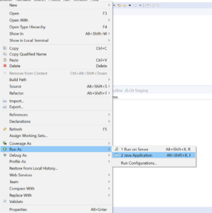

At its core, Flyway is a version control system for databases. It allows applying incremental changes to a database. In this article, we will be learning how to use Flyway with a Spring Boot application.

## Flyway Overview

As explained earlier, Flyway is a version control system for databases. To explain in very simple words, it allows specifying database DDL/DML in an SQL file (also known as a migration). It then applies these changes to the database. In case you need to apply further changes, you need to specify another migration with a higher version number with the incremental changes. Flyway then applies the new changes to the database.

Let us now understand how to use Flyway with Spring Boot and a MySQL database.

## Project Creation and Setup

**Step 1 - Create a new Maven Project**(Refer to[this](https://reshmabidikar.github.io/2018/10/how-to-create-a-maven-project-in-eclipse.html)blog post). This should create a project as shown below:

[](images/spring-boot-flyway/springboot-flyway-project.png)

**Step 2 – Add the Spring Boot, Flyway, and MySQL dependencies**. So, the **pom.xml** file should be similar to the following:

```xml
<project xmlns="http://maven.apache.org/POM/4.0.0"
  xmlns:xsi="http://www.w3.org/2001/XMLSchema-instance"
  xsi:schemaLocation="http://maven.apache.org/POM/4.0.0 https://maven.apache.org/xsd/maven-4.0.0.xsd">
  <modelVersion>4.0.0</modelVersion>
  <groupId>com.learnjava</groupId>
  <artifactId>learnjava-springboot-flyway-example</artifactId>
  <version>0.0.1-SNAPSHOT</version>
  <parent>
    <groupId>org.springframework.boot</groupId>
    <artifactId>spring-boot-starter-parent</artifactId>
    <version>1.4.1.RELEASE</version>
  </parent>

  <dependencies>
    <dependency>
      <groupId>org.springframework.boot</groupId>
      <artifactId>spring-boot-starter-data-jpa</artifactId>
    </dependency>
    <dependency>
      <groupId>mysql</groupId>
      <artifactId>mysql-connector-java</artifactId>
      <version>8.0.12</version>
    </dependency>
    <dependency>
      <groupId>org.flywaydb</groupId>
      <artifactId>flyway-core</artifactId>
    </dependency>
  </dependencies>
</project>
```

Step 3 - Create an **application.properties** file in the **src/main/resources** folder with the following content (Replace _<username>_ and _<password>_ with your database username and password):

```
spring.datasource.url=jdbc:mysql://localhost:3306/springbootflywaydb
spring.datasource.username=<username>
spring.datasource.password=<password>
spring.datasource.driverClassName=com.mysql.jdbc.Driver
spring.jpa.hibernate.dialect=org.hibernate.dialect.MySQLInnoDBDialect
spring.jpa.generate-ddl=true
spring.jpa.show-sql=true
spring.jpa.hibernate.ddl-auto = create

flyway.url = jdbc:mysql://localhost:3306/springbootflywaydb
flyway.user = <username>
flyway.password = <password>
```

Step 4 - Create a folder called **db/migration** within the **src/main/resources** folder. Add a file called **V1\_1\_\_create\_table.sql** with the following content:

```sql
CREATE TABLE `book` (
`id` int NOT NULL AUTO_INCREMENT,
`name` varchar(255) DEFAULT NULL,
`author` varchar(255) DEFAULT NULL,
PRIMARY KEY (`id`)
) ;
```

The migration name is significant. It needs to have the first character a V, followed by the version number (1\_1) in this case, followed by the separator (\_\_), followed by a name, followed by the .sql extension.

## Writing and Running Code

Step 5 - Create an appropriate package in **src/main/java** and create **Main.java** as follows:

```java
@SpringBootApplication
public class Main {
public static void main(String args[]){
System.out.println("In main");
SpringApplication.run(Main.class, args);
}

}
```
Step 6 - Run **Main.java** as a Java application as follows:

[](images/spring-boot-flyway/Run-main.png)

This will run the Spring Boot application and create a table called book within the springbootflywaydb. You can verify this in your database.

## Additional Steps

Step 7 - Add another file called **V1\_2\_\_insert\_data.sql** to the **src/main/resources/db/migration** folder with the following contents:

```sql
insert into BOOK (name,author) values ("Head First Java","Kathy Sierra");
```

Note that this migration has a higher version (1\_2) than the migration created earlier. So, this indicates to Flyway that this is a newer migration. So, Flyway applies this migration.

Step 8 - Run your code again. This will result in a record being inserted into the Book table.

## Further Learning

* [Mastering Thymeleaf with Spring Boot](https://click.linksynergy.com/deeplink?id=MnzIZAZNE5Y&mid=39197&murl=https%3A%2F%2Fwww.udemy.com%2Fcourse%2Fmastering-thymeleaf-with-spring%2F) 
* [Spring Boot Tutorial for beginners](https://click.linksynergy.com/deeplink?id=MnzIZAZNE5Y&mid=39197&murl=https%3A%2F%2Fwww.udemy.com%2Fcourse%2Fspring-boot-tutorial-for-beginners%2F) 
* [Spring Boot Fundamentals](https://click.linksynergy.com/deeplink?id=MnzIZAZNE5Y&mid=39197&murl=https%3A%2F%2Fwww.udemy.com%2Fcourse%2Fspringbootfundamentals%2F) 
* [Spring 5 with Spring Boot](https://click.linksynergy.com/deeplink?id=MnzIZAZNE5Y&mid=39197&murl=https%3A%2F%2Fwww.udemy.com%2Fcourse%2Fspring-5-with-spring-boot-2%2F)

## Conclusion

So, to summarize, Flyway is a version control system for databases. In order to use Flyway, you need to specify database changes as Flyway migrations. Flyway then applies these changes sequentially and incrementally. In this article, we saw how to use Flyway with a Spring Boot application and a MySQL database.
