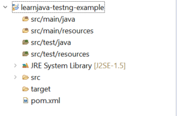
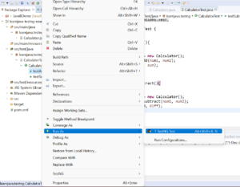
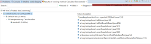

Earlier, we had seen how to use [JUNIT](how-to-use-junit-to-unit-test-code.md) for unit testing. TestNG is another such unit testing framework. In this article, we will be learning how to use TestNG with Maven and Eclipse.

## TestNG Overview

TestNG is a very powerful unit testing framework. Not only does it allow creating and running tests, but it has many advanced features like generating test reports, parameterizing tests, and much more. Let us now learn how to use TestNG to test a simple Java program.

## Project Creation and Setup

**Step 1 – Create a new Maven Project**(Refer to[this](https://reshmabidikar.github.io/2018/10/how-to-create-a-maven-project-in-eclipse.html) blog post). This should create a project as shown below:

[](images/testng-maven-and-eclipse/TestNG-Maven-Project-in-Eclipse.png)

**Step 2 – Add the TestNG dependencies** (You can refer to [this](https://reshmabidikar.github.io/2019/01/how-to-add-maven-dependencies-via-eclipse.html) blog post). Alternatively, you can add the following to your **pom.xml** file:

```xml
<dependency>
  <groupId>org.testng</groupId>
  <artifactId>testng</artifactId>
  <version>6.8</version>
  <scope>test</scope>
</dependency>

```

## Writing and Running Code

**Step 3 - Write code to be tested.** Suppose, you have a class as follows:

```java
public class Calculator {
  
  public int add(int num1,int num2) {
    return num1+num2;
  }
  
  public int subtract(int num1, int num2) {
    return num1-num2;
  }

}
```

This is a simple Java class. It has two methods `add` and `subtract`.

**Step 4: Write test class.** You can now create a Test class as follows:

```java
public class CalculatorTest {

@Test
public void testAdd(){
int num1=10;
int num2=20;
Calculator cal = new Calculator();
int sum = cal.add(num1, num2);
assertEquals(30, sum);
}

@Test
public void testSubtract(){
int num1=10;
int num2=20;
Calculator cal = new Calculator();
int diff = cal.subtract(num1, num2);
assertEquals(-10, diff);
}

}
```

We have now created a `CalculatorTest` class. The `testAdd` method tests the `Calculator.add` method while the `testSubtract` method tests the `Calculator.substract` method. Both methods have the `@Test` annotation specified. This annotation indicates that the method needs to be executed as a TestNG test. Both methods use the `assertEquals` method to verify the test result.

**Step 5: Executing the test.** You can execute the test in Eclipse by right-clicking on the test method/test class and clicking on **Run As -> TestNG** **Test** as shown below:


[](images/testng-maven-and-eclipse/TestNG-Execute-Test.png)

A successful test displays the following output:

[](images/testng-maven-and-eclipse/TestNG-Successful-Test.png)

A failed test displays the following output:

[](images/testng-maven-and-eclipse/TestNG-Failed-Test.png)

## Refactoring the code

TestNG includes several other annotations that help to optimize the test code. For example, in the code above, both the `testAdd` and `testSubtract` methods create a `Calculator` object. For a simple example like this, it does not matter much. However, sometimes object creation can be an expensive operation and you would want to create only one instance of the object and use it in all the tests. TestNG supports a `@BeforeClass` annotation. When specified on a method, the method is executed only once before all the tests. So, the code above can be rewritten using the `@BeforeClass` annotation as follows:

```java
public class CalculatorTest {
  
  private Calculator cal;
  
  @BeforeClass
  public void beforeMethod() {
    cal = new Calculator();
  }
  
  @Test
  public void testAdd(){
    int num1=10;
    int num2=20;
    int sum = cal.add(num1, num2);
    assertEquals(30, sum);
  }
  
  @Test
  public void testSubtract(){
    int num1=10;
    int num2=20;
    int diff = cal.subtract(num1, num2);
    assertEquals(-10, diff);
  }

}
```

You can download the complete source code for this example from my [Github repository](https://github.com/learnjavawithreshma/learnjava-testng-example).

## Further Reading

- [TestNG Complete Bootcamp](https://click.linksynergy.com/deeplink?id=MnzIZAZNE5Y&mid=39197&murl=https%3A%2F%2Fwww.udemy.com%2Fcourse%2Ftestng-complete-bootcamp%2F)
- [Learn TestNG from scratch](https://click.linksynergy.com/deeplink?id=MnzIZAZNE5Y&mid=39197&murl=https%3A%2F%2Fwww.udemy.com%2Fcourse%2Flearn-testng-testing-framework-from-scratch%2F)
- [Selenium WebDriver with Java for beginners](https://click.linksynergy.com/deeplink?id=MnzIZAZNE5Y&mid=39197&murl=https%3A%2F%2Fwww.udemy.com%2Fcourse%2Fselenium-for-beginners%2F)

## Conclusion

So, in this article, we learned about TestNG and some of its annotations. We also saw how to use TestNG with Maven and Eclipse.
